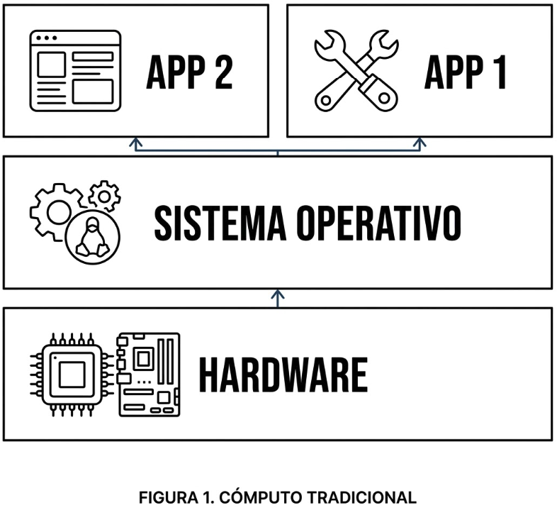
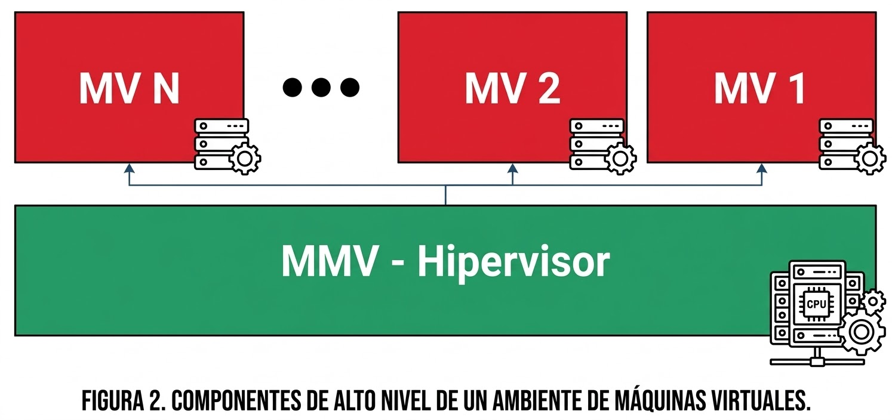
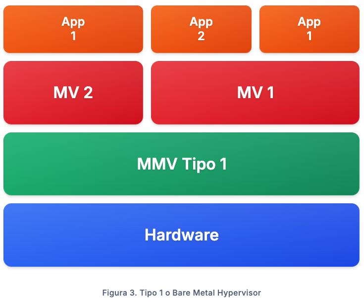
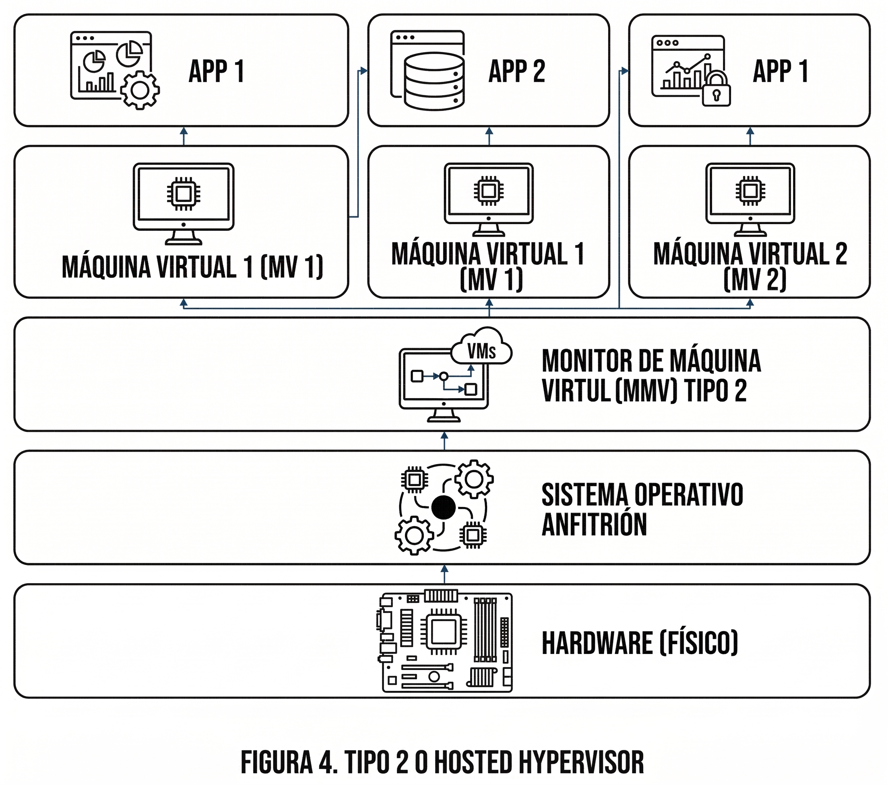

# Lectura 2 - Virtualización

Para comprender las tecnologías de contenerización, conviene iniciar por los fundamentos de la **virtualización**, que surgió como respuesta a la **subutilización de recursos** en servidores físicos. En muchos entornos, una aplicación rara vez aprovecha por completo la capacidad de procesamiento, memoria y almacenamiento disponibles, lo que genera ineficiencia y costos innecesarios.

## Conceptos básicos

Antes de avanzar, conviene precisar cuatro conceptos fundamentales.

- **Host**  
  Es la máquina física sobre la cual se ejecuta la virtualización. Aporta los recursos reales de hardware, como CPU, memoria, almacenamiento y red.

- **Guest OS**  
  Es el sistema operativo invitado que corre dentro de una máquina virtual. Desde su perspectiva, funciona como si estuviera instalado en una máquina propia, aunque en realidad comparte el hardware físico del host con otras instancias.

- **Hipervisor**  
  Es la capa de software que permite crear, ejecutar y administrar máquinas virtuales. Su función principal es abstraer el hardware físico y asignar recursos de manera controlada a cada VM, manteniendo aislamiento entre ellas.

- **Máquina virtual**  
  Es una instancia computacional aislada que emula un computador completo. Incluye hardware virtualizado, un sistema operativo invitado y las aplicaciones que se ejecutan sobre él.

## Enfoque tradicional

En un enfoque tradicional

- En un servidor o equipo se instala un **sistema operativo** directamente sobre el hardware.
- Las aplicaciones se ejecutan encima de ese sistema operativo.
- Todas las cargas dependen del mismo entorno base, lo que reduce flexibilidad y aislamiento.

## Virtualización con hipervisor y máquinas virtuales

La virtualización desacopla el software del hardware mediante una capa llamada **hipervisor**. Esta capa permite crear y administrar **máquinas virtuales (VMs)**, cada una ejecutando su propio **sistema operativo invitado (Guest OS)**, con su respectivo entorno de ejecución y dependencias.

En términos conceptuales, la virtualización permite ejecutar múltiples sistemas operativos y cargas de trabajo aisladas sobre el mismo hardware físico, compartiendo recursos de manera controlada.

> **Idea clave**  
> La virtualización ofrece **aislamiento y compatibilidad** por carga, pero a cambio de ejecutar un **sistema operativo completo** en cada VM.

## Comparación rápida entre ambos enfoques

- En el **enfoque tradicional**, un único sistema operativo administra directamente el hardware y hospeda las aplicaciones.
- En la **virtualización**, el hipervisor se ubica entre el hardware y las cargas, permitiendo que varias VMs independientes compartan el mismo servidor físico.
- El cambio central es que ya no se despliega solo una plataforma común para todas las aplicaciones, sino múltiples entornos aislados en una misma máquina.

## ¿Qué se virtualiza?

Una VM no solo encapsula aplicaciones. También recibe una vista abstraída de varios recursos del sistema.

- **CPU**  
  El hipervisor asigna procesadores virtuales a cada VM y distribuye el tiempo de ejecución sobre los núcleos físicos.

- **Memoria**  
  Cada VM recibe memoria virtual aislada, aunque físicamente comparta la RAM del host con otras VMs.

- **Almacenamiento**  
  Los discos virtuales permiten que cada VM tenga su propio sistema de archivos y persistencia independiente.

- **Red**  
  Las interfaces y redes virtuales permiten conectar VMs entre sí o hacia redes externas con aislamiento y control.

## Tipos de hipervisor

Existen dos tipos principales de hipervisores.

- **Tipo 1 (bare-metal)**  
  Se ejecuta directamente sobre el hardware del host, con alta eficiencia y menor sobrecarga.  
  **Ejemplos**: KVM, VMware ESXi.

  

- **Tipo 2 (hosted)**  
  Se ejecuta como una aplicación sobre un sistema operativo anfitrión existente.  
  **Ejemplos**: VirtualBox, VMware Workstation

  

## Aceleración por hardware y virtualización de E/S

La eficiencia de la virtualización moderna se incrementó gracias a extensiones de hardware diseñadas para este propósito. Tecnologías como **Intel VT-x** y **AMD-V** proporcionan instrucciones que permiten al hipervisor ejecutar VMs con menor sobrecarga computacional.

Adicionalmente, las capacidades de **IOMMU** como **Intel VT-d** y **AMD-Vi** habilitan el **device passthrough**, donde un dispositivo físico específico puede asignarse de forma exclusiva a una VM. Esto reduce o elimina la virtualización de entrada y salida en componentes críticos, como **GPUs** de alto rendimiento o controladores de red especializados.

En arquitecturas **ARM**, incluyendo **Apple Silicon**, existen mecanismos equivalentes de virtualización asistida por hardware. En ARM, el soporte se materializa mediante **Virtualization Extensions**, que habilitan la ejecución del hipervisor en un nivel de privilegio dedicado **EL2** y permiten una **traducción de memoria de segundo nivel** o **Stage-2**, análoga en propósito a EPT/NPT en x86.

De forma complementaria, para virtualización y aislamiento de E/S por DMA, plataformas ARM suelen apoyarse en un **IOMMU/SMMU**, que controla accesos de dispositivos a memoria y habilita esquemas como passthrough bajo políticas del hipervisor. En macOS sobre Apple Silicon, este soporte se expone a través de frameworks del sistema como **Hypervisor** y **Virtualization**.

## Ventajas y trade-offs de las máquinas virtuales

El uso de máquinas virtuales tiene varias ventajas.

- **Consolidación de servidores**  
  Permite ejecutar múltiples servicios aislados en VMs sobre un único servidor físico, optimizando recursos que de otro modo estarían subutilizados.

- **Reducción de costos de infraestructura**  
  Una organización puede correr múltiples servicios en VMs independientes sin asumir los costos de operar múltiples máquinas físicas.

- **Asignación más eficiente de recursos**  
  La virtualización permite segmentar CPU, memoria y almacenamiento de forma más acorde con las necesidades reales de cada carga.

- **Portabilidad del entorno**  
  Las VMs permiten empaquetar una plataforma con sus dependencias y configuración, facilitando despliegue y replicabilidad.

Sin embargo, estos beneficios tienen costos importantes.

- Cada VM debe cargar un **sistema operativo completo**.
- El consumo de **RAM**, **disco** y **CPU** suele ser mayor que en enfoques más livianos.
- Los tiempos de arranque suelen ser más altos.
- La administración y actualización de múltiples sistemas operativos invitados incrementa la carga operativa.
- La densidad por servidor suele ser menor que con contenedores.

## Ejemplo de uso

Suponga un servidor físico en una empresa. Sobre ese mismo servidor podrían ejecutarse tres VMs distintas.

- Una VM para la **base de datos**
- Una VM para el **servidor web**
- Una VM para **pruebas o desarrollo**

Cada una mantiene su propio sistema operativo, configuración y dependencias, con aislamiento entre cargas, aunque todas compartan el mismo hardware físico.

## ¿Cuándo conviene una VM?

Las máquinas virtuales siguen siendo una opción adecuada cuando se requiere alguna de estas condiciones.

- **Aislamiento fuerte** entre cargas
- Ejecución de **sistemas operativos distintos** sobre el mismo hardware
- Compatibilidad con **software legado**
- Necesidad de entornos completos, estables y fácilmente replicables para pruebas, laboratorios o infraestructura empresarial

## Puente hacia la contenerización

Este costo de empaquetar un **sistema operativo completo por carga** es una de las motivaciones que explica la aparición de enfoques más livianos, como la **contenerización**.

La diferencia estructural central es la siguiente.

- En una **VM**, cada instancia incluye su propio **Guest OS** y su propio entorno completo.
- En un **contenedor**, múltiples instancias comparten el **kernel del sistema operativo del host**, por lo que el empaquetado suele ser más ligero y eficiente.

La virtualización fue un paso decisivo para mejorar el uso del hardware y fortalecer el aislamiento entre cargas. Sin embargo, su costo operativo y de recursos abrió el camino a modelos más livianos para desplegar aplicaciones, como los contenedores.

## Preguntas de autoevaluación

1. ¿Qué trade-off central resume la virtualización?

## Referencias

- Tanenbaum, A. S., & Bos, H. (2015). *Modern Operating Systems* (4th ed.). Pearson. Capítulo “Virtualization”.
