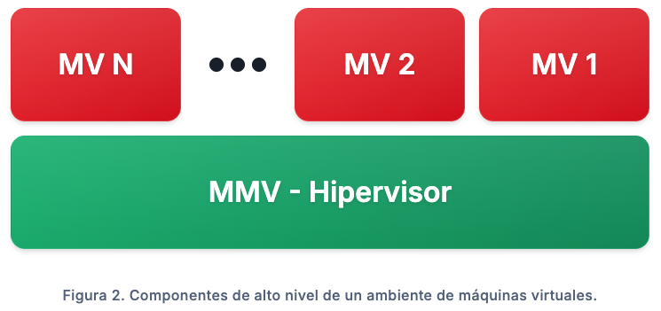

# Lectura 2 — Virtualización

**Conceptos básicos**

Antes de avanzar, conviene precisar cuatro conceptos fundamentales.

- **Host**  
  Es la máquina física sobre la cual se ejecuta la virtualización. Aporta los recursos reales de hardware, como CPU, memoria, almacenamiento y red.

- **Guest OS**  
  Es el sistema operativo invitado que corre dentro de una máquina virtual. Desde su perspectiva, funciona como si estuviera instalado en una máquina propia, aunque en realidad comparte el hardware físico del host con otras instancias.

- **Hipervisor**  
  Es la capa de software que permite crear, ejecutar y administrar máquinas virtuales. Su función principal es abstraer el hardware físico y asignar recursos de manera controlada a cada VM, manteniendo aislamiento entre ellas.

- **Máquina virtual**  
  Es una instancia computacional aislada que emula un computador completo. Incluye hardware virtualizado, un sistema operativo invitado y las aplicaciones que se ejecutan sobre él.

Para comprender las tecnologías de contenedorización, conviene iniciar por los fundamentos de la virtualización, que surgió como respuesta a la **subutilización de recursos** en servidores físicos. En muchos entornos, una aplicación rara vez aprovecha por completo la capacidad de procesamiento, memoria y almacenamiento disponibles, lo que genera ineficiencia y costos innecesarios.

## Enfoque tradicional

En un enfoque tradicional:

- En un servidor o equipo se instala un **sistema operativo** directamente sobre el hardware.
- Las aplicaciones se ejecutan encima de ese sistema operativo.

## Virtualización: hipervisor y máquinas virtuales

La virtualización desacopla el software del hardware mediante una capa llamada **hipervisor**. Esta capa permite crear y administrar **máquinas virtuales (VMs)**, cada una ejecutando su propio **sistema operativo invitado (Guest OS)**, con su respectivo entorno de ejecución y dependencias.

En términos conceptuales, la virtualización permite ejecutar múltiples sistemas operativos y cargas de trabajo aisladas sobre el mismo hardware físico, compartiendo recursos de manera controlada.

> **Idea clave:** se obtiene **aislamiento por VM** a cambio de ejecutar un **SO completo** por cada instancia.

## Tipos de hipervisor

Existen dos tipos principales de hipervisores:

- **Tipo 1 (bare-metal):** se ejecuta directamente sobre el hardware del host, con alta eficiencia y menor sobrecarga.  
  **Ejemplos:** **KVM**, **VMware ESXi**.

  

- **Tipo 2 (hosted):** se ejecuta como una aplicación sobre un sistema operativo anfitrión existente.  
  **Ejemplos:** **VirtualBox**, **VMware Workstation**.

  

## Aceleración por hardware y virtualización de E/S

La eficiencia de la virtualización moderna se incrementó gracias a extensiones de hardware diseñadas para este propósito. Tecnologías como **Intel VT-x** y **AMD-V** proporcionan instrucciones que permiten al hipervisor ejecutar VMs con menor sobrecarga computacional.

Adicionalmente, las capacidades de **IOMMU** (por ejemplo, **Intel VT-d** y **AMD-Vi**) habilitan el **device passthrough**, donde un dispositivo físico específico puede asignarse de forma exclusiva a una VM. Esto reduce o elimina la virtualización de entrada/salida en componentes críticos, como **GPUs** de alto rendimiento o controladores de red especializados.

En arquitecturas **ARM** (incluyendo **Apple Silicon**) existen mecanismos equivalentes de virtualización asistida por hardware. En ARM, el soporte se materializa mediante **Virtualization Extensions**, que habilitan la ejecución del hipervisor en un nivel de privilegio dedicado (**EL2**) y permiten una **traducción de memoria de segundo nivel (Stage-2)**, análoga en propósito a EPT/NPT en x86.

De forma complementaria, para virtualización y aislamiento de E/S por DMA, plataformas ARM suelen apoyarse en un **IOMMU/SMMU**, que cumple el rol de controlar accesos de dispositivos a memoria y habilitar esquemas como passthrough bajo políticas del hipervisor; en macOS sobre Apple Silicon, este soporte se expone a través de frameworks del sistema (p. ej., **Hypervisor**/**Virtualization**) que dependen de dichas extensiones de hardware.

## Ventajas y trade-offs de las máquinas virtuales

El uso de máquinas virtuales tiene varias ventajas:

- **Consolidación de servidores:** permite ejecutar múltiples servicios aislados en VMs sobre un único servidor físico, optimizando recursos que de otro modo estarían subutilizados. Sin embargo, implica una **sobrecarga de recursos** relevante, ya que cada VM debe cargar un sistema operativo completo.
- **Reducción de costos de infraestructura:** una organización puede correr múltiples servicios en VMs independientes sin asumir los costos de operar múltiples máquinas físicas. Por ejemplo, puede ejecutar un servidor web, un servidor de correo y un **LMS** (Learning Management System) en una sola máquina física, manteniendo aislamiento entre cargas.
- **Asignación más eficiente de recursos:** no todas las aplicaciones aprovechan la escalabilidad vertical. Aumentar CPU o memoria puede terminar en recursos subutilizados. La virtualización permite segmentar y asignar recursos de forma más acorde con las necesidades reales de cada carga.
- **Portabilidad del entorno:** las VMs permiten “empaquetar” una plataforma con sus dependencias y configuración, facilitando despliegue y replicabilidad. Aun así, este enfoque puede ser más pesado de lo necesario: una aplicación ligera, con pocas dependencias, igualmente requerirá una VM completa, lo que puede traducirse en desperdicio de recursos.

Este costo de “empaquetar un sistema operativo completo por carga” es una de las motivaciones que explica la aparición de enfoques más livianos, como la contenedorización, que virtualiza a nivel de sistema operativo.

## Preguntas de autoevaluación
- ¿Qué problema operativo motivó el surgimiento de la virtualización en servidores físicos?
- ¿Qué trade-off central resume la virtualización (aislamiento/compatibilidad vs costo de recursos) y cómo prepara el terreno para la contenedorización?

## Referencias
- Tanenbaum, A. S., & Bos, H. (2015). *Modern Operating Systems* (4th ed.). Pearson. Capítulo: “Virtualization”.

