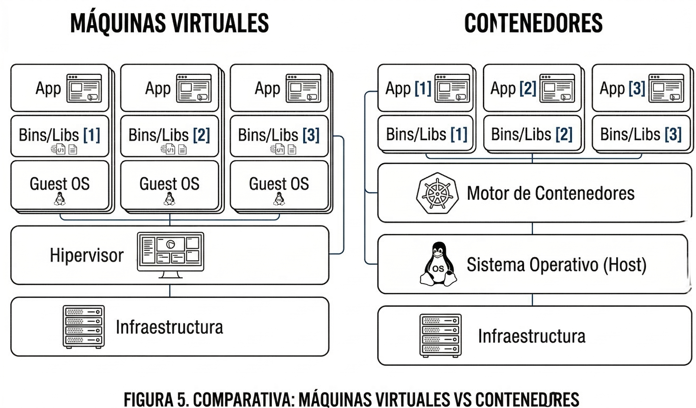

# Lectura 3 — Contenedores

Un contenedor responde a la misma necesidad de **encapsular una aplicación** y su entorno de ejecución, pero lo hace con una estructura más ligera que una máquina virtual. En lugar de empaquetar un **sistema operativo completo**, un contenedor incluye la **aplicación**, sus **dependencias** y las **bibliotecas** necesarias para ejecutarse. En este modelo, la virtualización ocurre a nivel de **sistema operativo**. Los contenedores **comparten el kernel** del sistema operativo anfitrión y se diferencian entre sí por mecanismos de aislamiento y control de recursos.

> **Idea clave**  
> Un contenedor es, en esencia, un **conjunto de procesos aislados** que comparten el kernel del host.

## Conceptos básicos

Antes de profundizar, conviene distinguir cuatro conceptos.

- **Imagen**  
  Es un artefacto empaquetado e inmutable que contiene la aplicación, sus dependencias y la configuración necesaria para ejecutarla.

- **Contenedor**  
  Es una instancia en ejecución de una imagen. Puede iniciarse, detenerse, reiniciarse o eliminarse.

- **Runtime**  
  Es el componente que ejecuta el contenedor y aplica los mecanismos de aislamiento y control definidos por la plataforma.

- **Kernel compartido**  
  Significa que los contenedores no arrancan su propio kernel. Todos usan el kernel del sistema operativo anfitrión.

## Contenedor y proceso

Un contenedor no debe entenderse como una “mini VM”. Conceptualmente, un contenedor es un **proceso** o un **conjunto de procesos** del sistema operativo anfitrión, pero ejecutados con aislamiento adicional.

Esto implica dos ideas importantes.

- Un contenedor suele tener un **proceso principal** como punto de entrada de la aplicación.
- Puede incluir **otros procesos auxiliares** cuando la aplicación o el entorno lo requieren.

Por eso, los contenedores se comportan más cerca de procesos nativos que de máquinas virtuales completas.

## Contenedores de aplicación y contenedores de sistema

Es importante distinguir dos enfoques.

- **Contenedores de aplicación**  
  Buscan empaquetar y ejecutar **un servicio o proceso principal** de la forma más ligera posible. Este es el enfoque típico de **Docker** y el estándar predominante en el desarrollo de software moderno.

- **Contenedores de sistema**  
  Buscan ofrecer una experiencia más cercana a un sistema completo, con múltiples servicios y un `init`, sin llegar a virtualizar hardware como una VM. Herramientas como **LXC** y gestores como **LXD** o **Incus** apuntan a este caso de uso.

> **Regla práctica**  
> Para aplicaciones modernas, microservicios, CI/CD y despliegues cloud, el estándar es el **contenedor de aplicación**.

## Por qué son más ligeros y rápidos

Los contenedores suelen ser **rápidos de crear e iniciar** porque no necesitan arrancar un kernel ni un sistema operativo invitado. Su ciclo de vida se parece más al de procesos del sistema operativo.

Esa ligereza se explica porque

- comparten el **kernel** del host
- no cargan un **Guest OS**
- suelen tener imágenes más pequeñas que una VM completa

Sin embargo, no son “gratis” en términos de costo operativo. En escenarios reales existe overhead asociado al

- **runtime**
- **filesystem por capas**
- **networking virtual**
- logging, sidecars y otros procesos auxiliares

## Implicación práctica del kernel compartido

Compartir kernel tiene una consecuencia práctica muy importante. Un contenedor depende del **tipo de kernel del host**.

Por ejemplo

- un contenedor Linux se ejecuta sobre un **kernel Linux**
- un contenedor Windows se ejecuta sobre un **kernel Windows**

Esto ayuda a explicar por qué los contenedores son más ligeros que una VM, pero también por qué su aislamiento y compatibilidad dependen del sistema operativo anfitrión.

## Aislamiento y control de recursos en Linux

A diferencia de las VMs, que se apoyan en virtualización de hardware para emular una máquina completa, los contenedores utilizan capacidades nativas del kernel del sistema operativo anfitrión. En Linux, los mecanismos principales son estos.

- **Namespaces**  
  Aíslan la “vista” que tiene un proceso sobre recursos del sistema, como
  - árbol de procesos
  - interfaces y stack de red
  - IDs de usuario
  - sistemas de archivos

- **Control Groups o cgroups**  
  Limitan y monitorean el consumo de recursos, como
  - CPU
  - memoria
  - E/S de disco

> **Trade-off**  
> Los contenedores son más livianos, pero su aislamiento depende del **kernel compartido**. En producción, esto suele complementarse con mecanismos como **seccomp**, **AppArmor** o **SELinux**, según la plataforma.

## Flujo básico de uso

De forma general, el ciclo de trabajo con contenedores sigue esta secuencia.

1. **Construir una imagen** con la aplicación y sus dependencias.
2. **Publicar o almacenar la imagen** en un registro o repositorio.
3. **Ejecutar un contenedor** a partir de esa imagen usando un runtime.
4. **Operar el contenedor** según sea necesario, por ejemplo iniciarlo, detenerlo, escalarlo o eliminarlo.

Este flujo separa dos momentos distintos.

- **Construcción** del artefacto
- **Ejecución** de la instancia

## Imagen, contenedor, runtime y kernel compartido

La arquitectura conceptual mínima del tema puede resumirse así.

- La **imagen** es el paquete.
- El **contenedor** es la instancia en ejecución.
- El **runtime** es el componente que la ejecuta.
- El **kernel compartido** es la base común que hace posible la ligereza del modelo.

Si estos cuatro elementos se entienden con claridad, resulta más fácil comprender el resto del ecosistema.

## Ecosistema de tecnologías para contenedores

En la oferta actual existen múltiples herramientas que cubren funciones similares, como construcción, ejecución y distribución, pero con diferencias técnicas relevantes. Para compararlas, conviene considerar estos ejes.

- **Construcción de imágenes**
- **Runtime de ejecución**
- **Modelo operativo**
- **Integración con Kubernetes**
- **Tipo de contenedor**

### Docker, BuildKit y containerd

Docker se apoya en un ecosistema modular y maduro.

- **BuildKit** mejora la construcción de imágenes, especialmente en caché y paralelismo.
- **containerd** es un runtime ampliamente adoptado.
- **Moby** agrupa componentes open source sobre los que se construye el stack.

**Uso típico**  
Desarrollo local, CI/CD y despliegues en producción o entornos cloud.

### Podman, Buildah y runtimes OCI

Podman y su ecosistema suelen destacarse por

- arquitectura sin daemon
- enfoque en seguridad
- soporte para flujos rootless en escenarios compatibles

Se integra con herramientas como

- **Buildah** para construcción de imágenes
- runtimes OCI como **runc** y, en algunos entornos, **crun**

**Uso típico**  
Entornos que priorizan seguridad, administración alineada con prácticas Linux y workflows flexibles.

### containerd en Kubernetes

**containerd** es un runtime ampliamente utilizado en entornos Kubernetes y puede operar de forma independiente de Docker como experiencia de usuario.

Esto refuerza una idea importante del ecosistema. Construir una imagen y ejecutar un contenedor son funciones relacionadas, pero no idénticas.

### LXC, LXD e Incus

Este grupo se asocia principalmente con **contenedores de sistema**.

- **LXC** ofrece una base ligera para contenedores de sistema.
- **LXD** facilitó durante años la administración de ese modelo.
- **Incus** continúa esa línea en el ecosistema comunitario.

**Uso típico**  
Laboratorios, entornos con experiencia cercana a una VM y ciertos casos donde se necesita administrar sistemas aislados con múltiples servicios.

## Contenedores en Windows

Microsoft introdujo soporte para contenedores en Windows Server 2016 y desde entonces ha evolucionado su integración con Docker y Kubernetes. Actualmente existen dos tipos principales.

### Windows Server Containers

- Comparten el **kernel de Windows**.
- Usan mecanismos de aislamiento y límites de recursos del sistema operativo.
- Son conceptualmente similares a los contenedores tradicionales en Linux, pero limitados a ejecutar binarios compatibles con Windows.

### Hyper-V Containers

- Ejecutan cada contenedor dentro de una **VM liviana** usando Hyper-V.
- Mantienen una experiencia de uso similar a contenedores, pero con **mayor aislamiento**.
- Son útiles en escenarios multitenant o con requerimientos de seguridad más estrictos.

## Interoperabilidad y OCI

La interoperabilidad en el ecosistema de contenedores es posible gracias a la **Open Container Initiative** u **OCI**, patrocinada por la Linux Foundation. OCI define especificaciones estándar para

- el **formato de imágenes**
- el **runtime**

Gracias a estas especificaciones, una imagen construida con una herramienta puede ser ejecutada por distintos runtimes compatibles. Un ejemplo de runtime de bajo nivel que implementa estas especificaciones es **runc**.

## Cuándo convienen y cuándo no

Los contenedores suelen convenir cuando se busca

- despliegue rápido
- portabilidad del entorno
- consistencia entre desarrollo, pruebas y producción
- mayor densidad de cargas por servidor
- integración con pipelines de CI/CD y plataformas cloud

En cambio, no siempre son la mejor opción cuando se requiere

- un **aislamiento más fuerte** similar al de una VM
- administrar una carga que depende de supuestos muy acoplados al sistema operativo completo

## Conexión con la motivación original

El costo de empaquetar un **sistema operativo completo por carga** en las VMs motivó enfoques más livianos. Los contenedores reducen significativamente esa sobrecarga al virtualizar a nivel de sistema operativo, manteniendo portabilidad y repetibilidad del entorno con tiempos de arranque más cercanos a los de procesos nativos.

## Preguntas de autoevaluación

1. ¿Qué implicación práctica tiene que los contenedores **compartan el kernel** del host?
2. Considerando que el rendimiento y la rapidez de los contenedores provienen de ejecutarse como procesos aislados sobre un kernel compartido, ¿qué decisiones de diseño tomaría para equilibrar **portabilidad**, **seguridad** y **desempeño** en un despliegue real?

## Referencias

- Tanenbaum, A., & Bos, H. *Modern Operating Systems* (4th ed.). Pearson. Capítulo sobre virtualización.
- Tankersley, C. *Docker for Developers*. Leanpub Publishing.
- Raj, P., & Sing, V. *Learning Docker*. Packt Publishing.
- Open Container Initiative. *OCI Image Format Specification* y *OCI Runtime Specification*.
