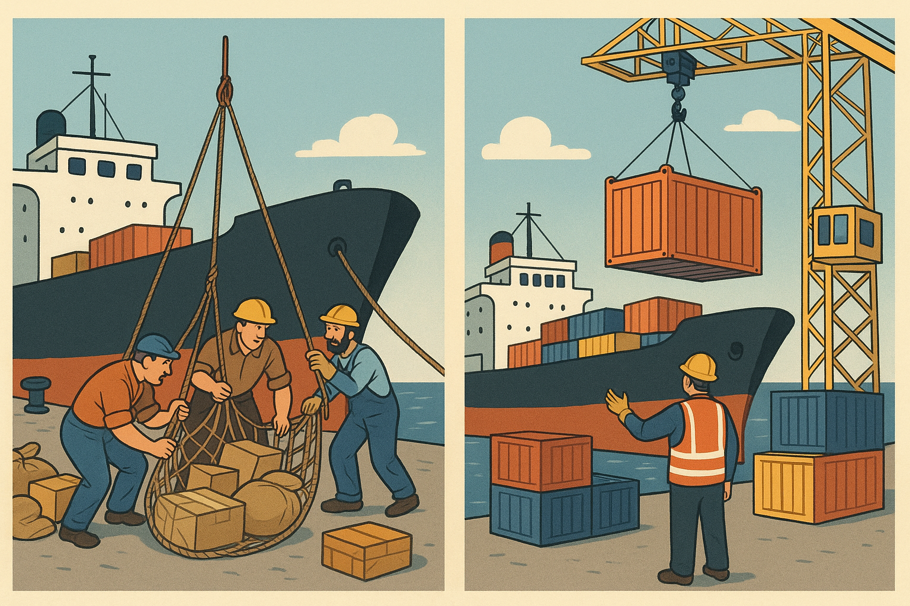
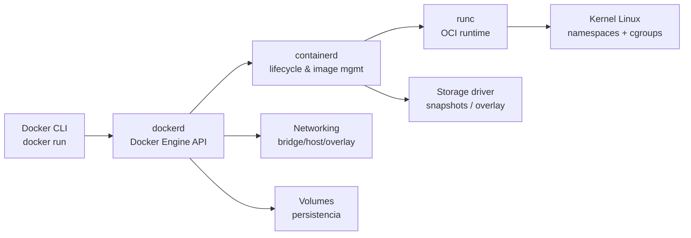

# Lectura 4 — Docker

Docker es una plataforma *open source* que estandariza el **empaquetado**, la **distribución** y la **ejecución** de aplicaciones mediante **contenedores**. Su propósito es permitir que una misma aplicación se ejecute de forma consistente entre entornos (desarrollo, pruebas, producción), mitigando el problema clásico de **“en mi máquina funciona”** al encapsular el software con sus dependencias y configuración necesaria.

> **Idea clave:** Docker no “empaqueta un sistema operativo completo”; empaqueta un **filesystem** y **metadatos** para ejecutar procesos aislados sobre el **kernel del host** (o sobre una VM liviana en ciertos casos, como Hyper-V Containers).

## El contenedor marítimo: Analogía & estandarización

Antes del contenedor marítimo, la carga se movía como piezas heterogéneas: lento, costoso y propenso a errores. El contenedor estandariza *la unidad de transporte*; un operario de grúa no necesita conocer el contenido para moverlo eficientemente.

De manera similar, Docker estandariza la unidad de despliegue: el **contenedor**. El motor ejecuta esa unidad en cualquier sistema compatible, basándose en un estándar (OCI), sin depender de cómo fue construida internamente la aplicación.

## Arquitectura de Docker Engine

Docker se compone de varios elementos que colaboran para construir y ejecutar contenedores:

- **Docker CLI (`docker`)**: interfaz de línea de comandos.
- **Docker Engine / Daemon (`dockerd`)**: expone la API y orquesta operaciones (build, run, pull/push, redes, volúmenes).
- **`containerd`**: gestiona el ciclo de vida de contenedores (pull, snapshot, ejecución).
- **Runtime OCI (p. ej., `runc`)**: crea el contenedor a nivel de kernel (namespaces, cgroups, mounts, etc.).
- **BuildKit**: motor de construcción eficiente de imágenes (caché, paralelismo, mejores *builds* reproducibles).

### Flujo típico de ejecución

## Objetos fundamentales en Docker

### 1) Imágenes

Las **imágenes** son plantillas para crear contenedores. Incluyen:

- **Binarios**
- **Bibliotecas**
- **Archivos de configuración**
- **Metadatos de ejecución** (p. ej., comando por defecto)

Una imagen se construye como un conjunto de **capas de solo lectura** (*read-only*), lo que favorece **reutilización**, **caché** y **distribución eficiente**.

#### Inmutabilidad y reproducibilidad 

- Una imagen es **inmutable** en el sentido de que su contenido, identificado por **digest**, no cambia.
- Esto **no** garantiza resultados idénticos en ejecución, porque también influyen:
  - **variables de entorno**
  - **datos de entrada**
  - **servicios externos** (red, APIs)
  - **tiempo/reloj**, **secrets**, entre otros factores

> **Buenas prácticas**
>
> - Use **digests** para fijar versiones exactas.
> - Trate los **tags** como referencias prácticas (y potencialmente mutables).

#### Construcción de imágenes

Las imágenes se construyen principalmente mediante:

- **Dockerfile** *(recomendado y reproducible)*
- En menor medida, “capturando” cambios desde un contenedor en ejecución *(posible, pero menos controlado y menos reproducible)*

### 2) Contenedores

Un **contenedor** es una instancia en ejecución (o detenida) creada a partir de una imagen. En el filesystem, un contenedor agrega una **capa de lectura/escritura (RW)** sobre las capas **RO** de la imagen (*copy-on-write*).

- Los cambios en la capa **RW** son **locales al host**.
- Si elimina el contenedor, esa capa **RW se pierde**.
- Puede detener y reiniciar un contenedor en el mismo host mientras exista, conservando su capa RW; sin embargo, **no es una estrategia adecuada de persistencia** en ambientes modernos.

> **Regla práctica:** “un servicio por contenedor” es una recomendación de diseño; un contenedor puede tener **uno o varios procesos** según el caso.

### 3) Persistencia: volúmenes y estado

La capa **RW** del contenedor es un lugar **frágil** para estado. Para persistir datos correctamente se usan:

- **Volúmenes (Volumes):** almacenamiento gestionado por Docker, desacoplado del ciclo de vida del contenedor.
- **Bind mounts:** mapeo explícito de rutas del host *(útil en desarrollo; requiere cuidado en producción)*.

> **Principio:** trate los contenedores como **efímeros** y externalice el estado (volúmenes, bases de datos, servicios gestionados, almacenamiento distribuido).

### 4) Redes

Docker provee **networking** para conectar contenedores y exponer servicios:

- redes tipo **bridge** *(común en un host)*
- **host** *(sin aislamiento de red)*
- otras opciones *(según plataforma/driver)*

Cada contenedor suele tener su propia interfaz y configuración de red virtual, lo cual aporta **aislamiento** y **flexibilidad**, pero introduce complejidad operativa (DNS interno, puertos, políticas).

## Aislamiento en Linux (lo que realmente “hace” el contenedor)

El aislamiento se implementa con capacidades del kernel, principalmente:

- **Namespaces:** aíslan recursos como:
  - **PID** (procesos)
  - **NET** (red)
  - **IPC**
  - **MNT** (montajes)
  - **UTS** (hostname/identidad)
- **cgroups:** limitan y monitorean recursos como **CPU**, **memoria** y **E/S**.

> **Trade-off:** el aislamiento es más liviano que una VM porque se comparte el kernel; por ello, en producción se refuerza con controles de seguridad.

## Registro (Registry) y distribución de imágenes

Para aprovisionar un contenedor en un nuevo nodo se requiere:

- la **imagen** (capas + metadatos)
- y recursos de **cómputo**

Los **registros de imágenes** almacenan y distribuyen imágenes (típicamente en formato **OCI**). Conceptos clave:

- **Registry:** el servicio (p. ej., Docker Hub, registries privados)
- **Repository:** el “espacio” lógico de una imagen (p. ej., `org/app`)
- **Tags:** nombres de versión convenientes (p. ej., `1.2.0`, `latest`)
- **Digests:** identificadores criptográficos **inmutables** del contenido real

> **Buenas prácticas:** versionar con tags claros y fijar *deploys* críticos por **digest** cuando se requiera máxima trazabilidad.

## Seguridad mínima recomendada (Docker en producción)

- Evite ejecutar procesos como **root** cuando sea posible (por ejemplo, flujos **rootless** y buenas prácticas de Dockerfile).
- Reduzca privilegios: use capacidades Linux mínimas y evite `--privileged` salvo necesidad justificada.
- Aplique perfiles y controles:
  - **seccomp**
  - **AppArmor** o **SELinux** (según distribución)
  - políticas de red/aislamiento

## Cuándo utilizar Docker

Docker es especialmente útil cuando se requiere:

- despliegue consistente entre entornos
- portabilidad y distribución de artefactos (imágenes)
- escalabilidad y tolerancia a fallos (especialmente combinado con orquestación)
- habilitar prácticas *cloud native* y arquitecturas de microservicios
- soportar **CI/CD**: construir, probar y desplegar con pipelines automatizados

## Cuándo NO utilizar Docker (o cuándo complementarlo)

Docker puede no ser la mejor opción (o requiere refuerzo) en escenarios como:

- **multi-tenant estricto** o aislamiento fuerte (preferible VM, sandboxing más robusto o contenedores con aislamiento reforzado)
- aplicaciones con dependencia rígida de **kernel/driver** o requisitos especiales de hardware sin estrategia clara (p. ej., aceleración GPU sin configuración adecuada)
- sistemas con **estado local crítico** si no existe una estrategia explícita de persistencia (volúmenes/replicación/servicios gestionados)

## Convivencia con máquinas virtuales

La elección entre contenedores y máquinas virtuales no es excluyente. En la práctica, con frecuencia se combinan:

- **VMs** para aislamiento fuerte y administración de infraestructura
- **Contenedores** para empaquetado ligero, despliegue rápido y portabilidad

En conjunto, ambas tecnologías se consideran **complementarias** dentro de arquitecturas modernas.

## Preguntas de autoevaluación

1. ¿Qué problema del despliegue busca resolver Docker y cómo contribuye a mitigar el “en mi máquina funciona”?
2. ¿Qué implica el trade-off de “kernel compartido” frente al aislamiento de una VM?

## Referencias

- Tanenbaum, A., & Bos, H. *Modern Operating Systems* (4th ed.). Pearson. (Capítulo: Virtualization).
- Tankersley, C. *Docker for Developers*. Leanpub Publishing.
- Raj, P., & Sing, V. *Learning Docker*. Packt Publishing.
