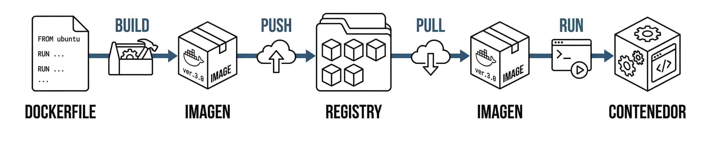
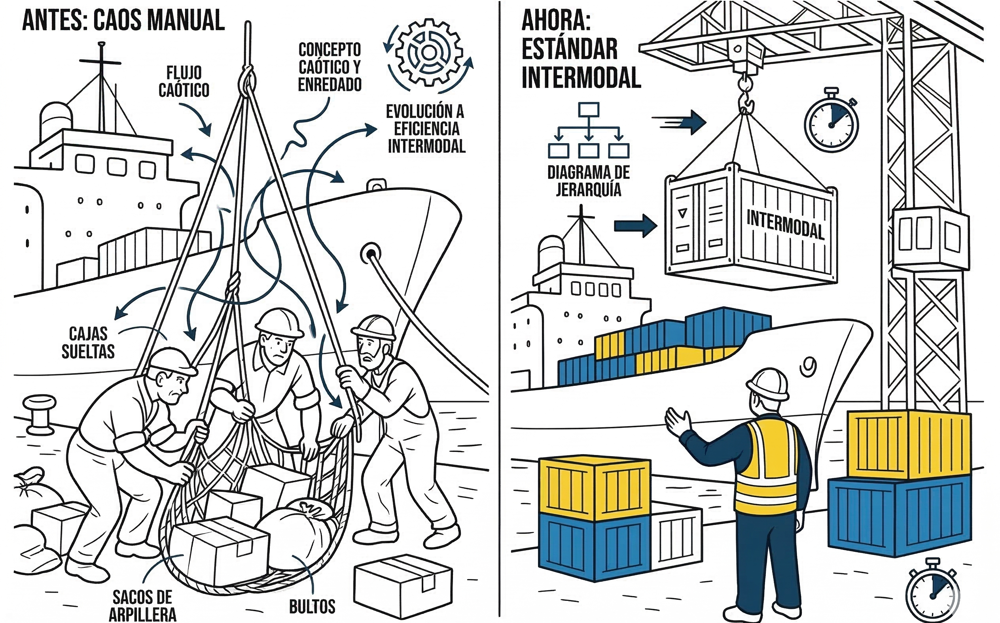
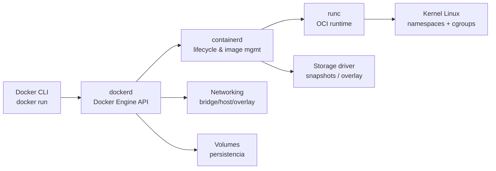
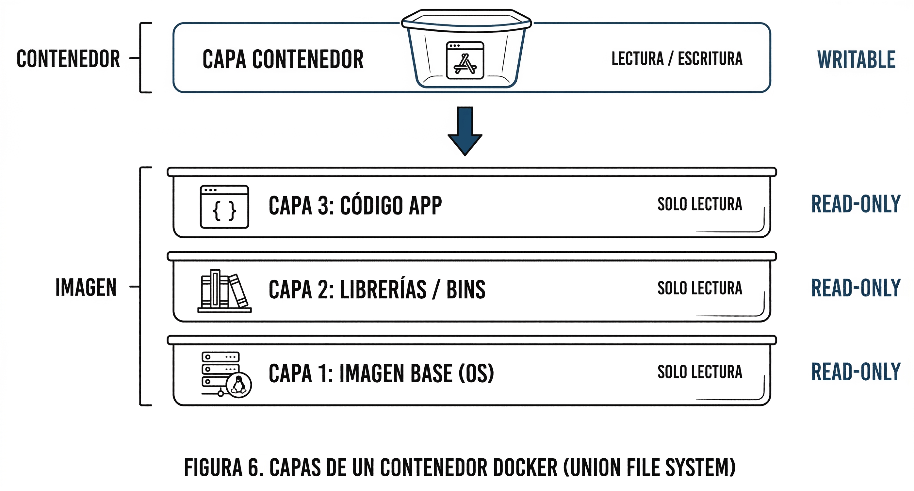
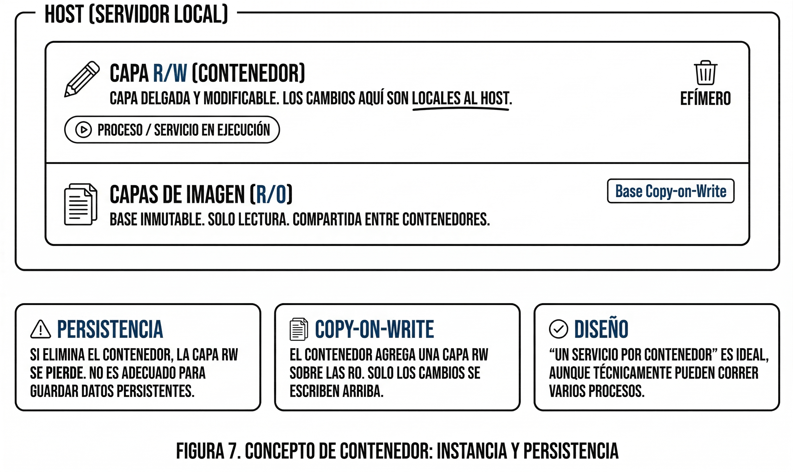
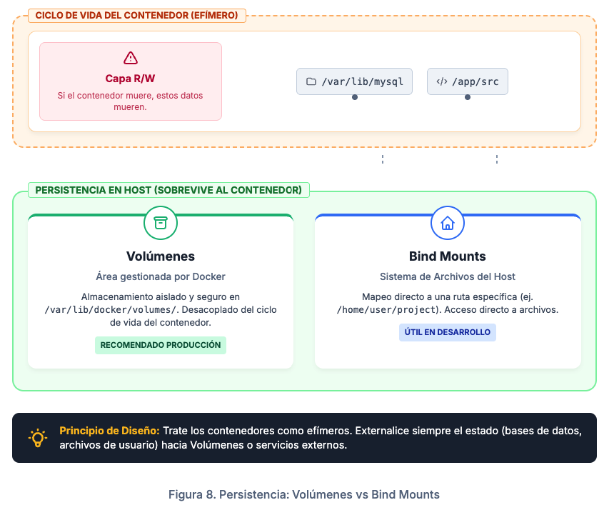
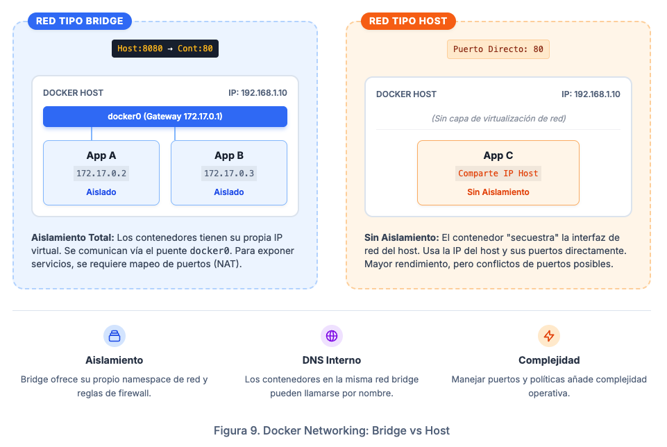
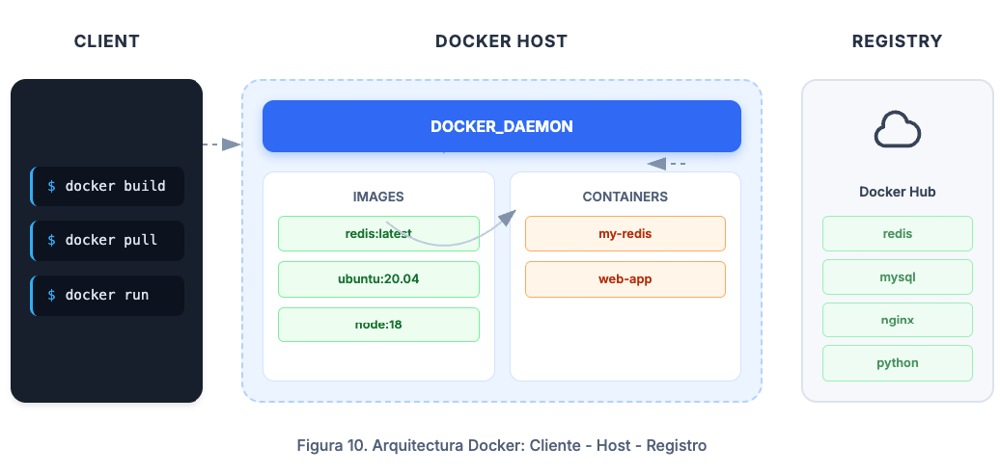

# Lectura 4 — Docker

Docker es una plataforma open source que estandariza el **empaquetado**, la **distribución** y la **ejecución** de aplicaciones mediante **contenedores**. Su propósito es permitir que una misma aplicación se ejecute de forma consistente entre entornos (desarrollo, pruebas, producción), mitigando el problema clásico de **"en mi máquina funciona"** al encapsular el software con sus dependencias y configuración necesaria.

> **Distinción importante:** Docker no es sinónimo de contenedor. Docker es una herramienta y un ecosistema; el **contenedor** es la unidad de ejecución. Otros entornos y runtimes también pueden crear y ejecutar contenedores siguiendo los mismos estándares.

> **Idea clave:** Docker no empaqueta un sistema operativo completo; empaqueta un **filesystem** y **metadatos** para ejecutar procesos aislados sobre el **kernel del host**.

## Tres conceptos centrales

Antes de entrar en la arquitectura conviene tener claras tres ideas y su relación:

| Concepto | Qué es | Quién lo produce |
|---|---|---|
| **Dockerfile** | Instrucciones para construir una imagen | El desarrollador |
| **Imagen** | Artefacto distribuible; filesystem empaquetado en capas | El proceso `build` |
| **Contenedor** | Instancia en ejecución (o detenida) creada a partir de una imagen | El proceso `run` |

El flujo básico de trabajo es siempre el mismo:



La imagen es el artefacto que se versiona, almacena en un registry y se transporta entre entornos. El contenedor es el proceso vivo que resulta de ejecutarla.

## El contenedor marítimo: analogía y estandarización

Antes de la estandarización del contenedor marítimo, la carga se transportaba en formatos diversos, lo que hacía el proceso más lento, costoso y propenso a errores. El contenedor resolvió parte de ese problema al convertir el transporte en una unidad estándar. Así, un operario puede moverlo sin necesidad de conocer su contenido.

De forma análoga, Docker estandariza la unidad de despliegue en software mediante el **contenedor**. Esto permite ejecutar una aplicación de manera consistente en sistemas compatibles, apoyándose en el estándar **OCI** (*Open Container Initiative*), sin depender de los detalles internos con los que fue construida.

> **Nota**  
> **OCI** define estándares para imágenes y runtimes que permiten la interoperabilidad entre distintas herramientas del ecosistema. Docker es una de esas implementaciones, no la única.



## Arquitectura de Docker Engine

Docker se compone de varios elementos que colaboran para construir y ejecutar contenedores:

- **Docker CLI (`docker`)**: interfaz de línea de comandos usada por el desarrollador.
- **Docker Engine / Daemon (`dockerd`)**: expone la API y orquesta operaciones (build, run, pull/push, redes, volúmenes).
- **`containerd`**: gestiona el ciclo de vida de contenedores (pull, snapshot, ejecución).
- **Runtime OCI (`runc`)**: crea el contenedor a nivel de kernel usando namespaces, cgroups y mounts.
- **BuildKit**: motor de construcción de imágenes con caché eficiente y paralelismo.

> **Para una primera lectura**, lo relevante es que Docker CLI delega en `dockerd`, que a su vez delega en componentes especializados. No es necesario memorizar cada capa; lo que importa es entender que el aislamiento real lo provee el **kernel de Linux**, no Docker por sí mismo.

### Flujo típico de ejecución



### Docker en macOS y Windows

En Linux, Docker interactúa directamente con el kernel del host. En macOS y Windows no existe un kernel Linux nativo, por lo que **Docker Desktop** levanta una VM liviana que proporciona ese kernel. Para el desarrollador la experiencia es transparente, pero conviene saber que en esos entornos hay una capa adicional de virtualización.

## Objetos fundamentales en Docker

### 1) Imágenes

Las **imágenes** son plantillas para crear contenedores. Incluyen binarios, bibliotecas, archivos de configuración y metadatos de ejecución (como el comando por defecto).

Una imagen se construye como un conjunto de **capas de solo lectura** (*read-only*). Cada instrucción en el Dockerfile puede generar una nueva capa. Esto importa en la práctica por dos razones:

- **Reutilización y caché:** si una capa no cambió entre builds, Docker la reutiliza en lugar de reconstruirla. Los builds son más rápidos.
- **Distribución eficiente:** al transferir una imagen, solo se envían las capas que el destino no tiene todavía, no la imagen completa.



#### Inmutabilidad y reproducibilidad

Una imagen es **inmutable** en el sentido de que su contenido, identificado por **digest**, no cambia una vez construida. Esto no garantiza resultados idénticos en ejecución, porque también influyen variables de entorno, datos de entrada, servicios externos y el estado del mundo en el momento de correr el contenedor.

- Use **digests** para fijar versiones exactas en despliegues críticos.
- Los **tags** (como `latest` o `1.2.0`) son referencias convenientes pero potencialmente mutables.

#### Construcción de imágenes

Las imágenes se construyen principalmente mediante un **Dockerfile**, que describe de forma declarativa y reproducible cada capa. También es posible capturar cambios desde un contenedor en ejecución, pero esa práctica es menos controlada y menos reproducible.

**Ejemplo mínimo de Dockerfile:**

```dockerfile
# Imagen base
FROM python:3.12-slim

# Directorio de trabajo dentro del contenedor
WORKDIR /app

# Copiar dependencias e instalarlas (capa separada para aprovechar caché)
COPY requirements.txt .
RUN pip install --no-cache-dir -r requirements.txt

# Copiar el código de la aplicación
COPY . .

# Comando por defecto al ejecutar el contenedor
CMD ["python", "main.py"]
```

Cada instrucción (`FROM`, `COPY`, `RUN`) puede generar una capa. Si `requirements.txt` no cambia entre builds, la capa de dependencias se reutiliza desde caché.

### 2) Contenedores

Un **contenedor** es una instancia en ejecución (o detenida) creada a partir de una imagen. En el filesystem, el contenedor agrega una **capa de lectura/escritura (RW)** sobre las capas **RO** de la imagen mediante *copy-on-write*.

- Los cambios en la capa **RW** son **locales al host**.
- Si elimina el contenedor, esa capa **RW se pierde**.
- Puede detener y reiniciar un contenedor en el mismo host mientras exista, conservando su capa RW; sin embargo, **no es una estrategia adecuada de persistencia** en ambientes modernos.



#### Un servicio por contenedor

"Un servicio por contenedor" es una recomendación de diseño, no una regla absoluta. El motivo es práctico: contenedores de responsabilidad única son más fáciles de **escalar, reiniciar, monitorear y mantener** de forma independiente. Un contenedor puede tener más de un proceso si el caso lo justifica.

### 3) Persistencia: volúmenes y estado

La capa **RW** del contenedor es un lugar frágil para guardar estado. Para persistir datos correctamente se usan:

- **Volúmenes:** almacenamiento gestionado por Docker, desacoplado del ciclo de vida del contenedor.
- **Bind mounts:** mapeo explícito de rutas del host. Útil en desarrollo; requiere cuidado en producción.



> **Principio:** trate los contenedores como **efímeros** y externalice el estado en volúmenes, bases de datos o servicios gestionados.

### 4) Redes y puertos

Docker provee **networking** para conectar contenedores y exponer servicios:

- **Bridge** *(común en un host):* los contenedores se comunican entre sí a través de una red virtual interna.
- **Host** *(sin aislamiento de red):* el contenedor comparte directamente la red del host.



#### Exponer y publicar puertos

Una de las operaciones más frecuentes es hacer accesible un servicio desde fuera del contenedor. Docker distingue dos conceptos:

- **Exponer (`EXPOSE`):** declaración en el Dockerfile de que el proceso escucha en un puerto. Es documentación, no abre nada por sí sola.
- **Publicar (`-p`):** mapea un puerto del host a un puerto del contenedor en tiempo de ejecución.

```bash
# El servicio dentro del contenedor escucha en 8080
# Se publica en el puerto 3000 del host
docker run -p 3000:8080 mi-imagen
```

## Aislamiento en Linux

En este contexto, **aislamiento** significa que el sistema operativo crea la ilusión de que un conjunto de procesos "vive" en su propio entorno: ve su propio árbol de procesos, sus interfaces de red, sus puntos de montaje y sus recursos, como si no compartiera el host con otras cargas.

En realidad, todos esos procesos siguen ejecutándose sobre el **mismo kernel**, con **fronteras lógicas** que limitan lo que pueden ver, usar y afectar. Docker no crea estos mecanismos: se **apoya** en capacidades que el kernel de Linux ya provee.

Los mecanismos principales son:

- **Namespaces:** aíslan recursos como PID (procesos), NET (red), IPC, MNT (montajes) y UTS (hostname).
- **cgroups:** limitan y monitorean el consumo de CPU, memoria y E/S.

> **Trade-off:** el aislamiento es más liviano que una VM porque se comparte el kernel. Por ello, en producción se refuerza con controles de seguridad adicionales.

## Registro (Registry) y distribución de imágenes

Para desplegar un contenedor en un nuevo nodo se necesitan la **imagen** (capas y metadatos) y recursos de **cómputo**. Los **registros de imágenes** almacenan y distribuyen imágenes en formato OCI.



Conceptos clave:

- **Registry:** el servicio (p. ej., Docker Hub, registries privados).
- **Repository:** el espacio lógico de una imagen (p. ej., `org/app`).
- **Tags:** nombres de versión convenientes (p. ej., `1.2.0`, `latest`).
- **Digests:** identificadores criptográficos **inmutables** del contenido real.

> **Práctica recomendada:** versionar con tags claros y fijar despliegues críticos por **digest** cuando se requiera máxima trazabilidad.

## Seguridad mínima en producción

El objetivo es **reducir la superficie de ataque** y **limitar el impacto** de un contenedor comprometido, aplicando el principio de **mínimo privilegio**.

Las medidas más importantes como punto de partida:

- Evite ejecutar procesos como **root** cuando sea posible (flujos rootless y buenas prácticas de Dockerfile).
- No use `--privileged` salvo necesidad justificada.
- Reduzca las **Linux capabilities** al mínimo necesario.

En etapas posteriores pueden aplicarse controles adicionales como **seccomp**, **AppArmor** o **SELinux**, que son mecanismos de hardening del kernel, no conceptos de Docker en sí.

## Cuándo utilizar Docker

Docker es especialmente útil cuando se requiere:

- despliegue consistente entre entornos
- portabilidad y distribución de artefactos
- soportar pipelines de **CI/CD**
- habilitar arquitecturas de microservicios y prácticas cloud native

> **Importante:** Docker facilita el empaquetado y despliegue de contenedores, pero **no resuelve por sí solo** la tolerancia a fallos ni el escalado robusto. Esas capacidades dependen del entorno de ejecución y de herramientas de **orquestación** como Kubernetes.

## Cuándo no utilizar Docker (o cuándo complementarlo)

Docker puede no ser la mejor opción en escenarios como:

- **multi-tenant estricto:** si se requiere aislamiento fuerte entre cargas, una VM o un entorno con sandbox más robusto puede ser más adecuado.
- **dependencias de kernel o hardware especializadas** sin una estrategia clara (por ejemplo, aceleración GPU sin la configuración correcta).
- **estado local crítico** si no existe una estrategia explícita de persistencia.


## Convivencia con máquinas virtuales

La elección entre contenedores y VMs no es excluyente. En la práctica se combinan con frecuencia:

- **VMs** para aislamiento fuerte y administración de infraestructura.
- **Contenedores** para empaquetado ligero, despliegue rápido y portabilidad.

Ambas tecnologías son **complementarias** en arquitecturas modernas.


## Preguntas de autoevaluación

1. ¿Qué problema del despliegue busca resolver Docker y cómo contribuye a mitigar el "en mi máquina funciona"?
2. ¿Por qué las imágenes se construyen en capas y qué ventajas tiene eso en tiempo de build y distribución?
3. ¿Qué implica el trade-off de "kernel compartido" frente al aislamiento de una VM?

## Referencias

- Tanenbaum, A., & Bos, H. *Modern Operating Systems* (4th ed.). Pearson. (Capítulo: Virtualization).
- Tankersley, C. *Docker for Developers*. Leanpub Publishing.
- Raj, P., & Sing, V. *Learning Docker*. Packt Publishing.
- Docker, Inc. *Docker Documentation*. <https://docs.docker.com> (especialmente las secciones sobre imágenes, volúmenes, redes y Dockerfile reference).
- Open Container Initiative. *OCI Image Specification* y *OCI Runtime Specification*. <https://opencontainers.org>
