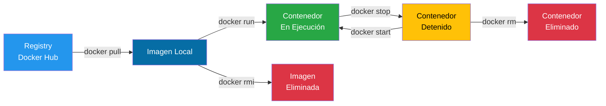

# Lectura 01 - Comandos Básicos de Docker

## Introducción

En esta lectura se exploran los comandos básicos de Docker, enfocándose en la descarga de imágenes y la gestión de contenedores (instanciar, detener, eliminar).

Se asume una instalación estándar de Docker. En distribuciones GNU/Linux como Ubuntu o Debian, si su usuario no tiene permisos directos, deberá anteponer `sudo` a cada comando. Este paso generalmente no es necesario si opera como usuario root o en otros sistemas operativos.

> [!TIP]
> Para evitar usar `sudo` constantemente, puede agregar su usuario al grupo docker:
> ```bash
> sudo usermod -aG docker $USER
> ```
> Luego cierre sesión y vuelva a iniciarla para aplicar los cambios.

### Ciclo de Vida de un Contenedor

El siguiente diagrama ilustra el ciclo de vida típico de un contenedor Docker:



## Gestión de Imágenes

### Comando pull

El comando `docker pull` descarga una imagen desde un registry, que es un repositorio de imágenes. Por defecto, Docker utiliza [Docker Hub](https://hub.docker.com/) como su registry principal.

Las imágenes descargadas sirven como base para crear contenedores o nuevas imágenes personalizadas.

**Sintaxis:**

```bash
$ docker pull <nombre-de-la-imagen>
```

**Ejemplo:**

```bash
$ docker pull alpine
```

> [!NOTE]
> Puede especificar una versión concreta usando tags: `docker pull alpine:3.19`
> Si no especifica un tag, Docker descarga la versión `latest` por defecto.

### Comando images

Para listar las imágenes de Docker disponibles en su sistema local, utilice el comando `docker images`. También es válido el alias `docker image ls`.

**Sintaxis:**

```bash
$ docker images
```

Este comando muestra una tabla con información sobre cada imagen:

| Campo | Descripción |
|-------|-------------|
| `REPOSITORY` | El nombre de la imagen |
| `TAG` | La versión o etiqueta (ej. `latest`) |
| `IMAGE ID` | El identificador único |
| `CREATED` | La fecha de creación |
| `SIZE` | El tamaño de la imagen |

### Comando rmi

Para eliminar una imagen, primero visualice las imágenes disponibles con `docker images`. Luego, utilice `docker rmi` seguido del nombre o ID de la imagen que desea borrar.

**Sintaxis:**

```bash
$ docker rmi <nombre-de-la-imagen>
# o usando el ID
$ docker rmi <image-id>
```

> [!WARNING]
> No se puede eliminar una imagen si está siendo utilizada por algún contenedor (en ejecución o detenido). Primero debe eliminar el contenedor que la usa con `docker rm`.

El comando `docker image rm` es el alias más moderno y recomendado para `docker rmi`. Ambos comandos cumplen exactamente la misma función:

```bash
$ docker image rm <nombre-de-la-imagen>
```

## Gestión de Contenedores

### Comando run

El comando `docker run` permite iniciar un contenedor a partir de una imagen descargada. Si la imagen no se ha descargado previamente del registry, Docker procede a descargarla antes de instanciar el contenedor (es decir, ejecuta un `pull` automáticamente).

**Sintaxis:**

```bash
$ docker run <nombre-de-la-imagen>
```

**Ejemplo:**

```bash
$ docker run alpine
```

> [!NOTE]
> Al ejecutar `docker run alpine` sin especificar un comando adicional, Docker crea y ejecuta un contenedor basado en la imagen Alpine, pero como la imagen no tiene un proceso definido por defecto que permanezca en ejecución, el contenedor se inicia y termina inmediatamente. Este comportamiento se debe a que, por defecto, Alpine ejecuta y finaliza el proceso `/bin/sh` de manera no interactiva.

#### Asignar nombre a un contenedor

Por defecto, Docker asigna nombres aleatorios a los contenedores. Para asignar un nombre específico, use la opción `--name`:

```bash
$ docker run --name mi_contenedor -it alpine sh
```

Esto facilita la identificación y gestión en comandos posteriores:

```bash
$ docker stop mi_contenedor
$ docker logs mi_contenedor
$ docker rm mi_contenedor
```

### Comando ps

El comando `docker ps` lista los contenedores en ejecución.

**Sintaxis:**

```bash
# Listar contenedores en ejecución
$ docker ps

# Listar TODOS los contenedores (incluidos los detenidos)
$ docker ps -a
```

**Ejemplo con modo interactivo:**

```bash
$ docker run -it alpine sh
```

Al ejecutar este comando, Docker crea un nuevo contenedor a partir de la imagen Alpine y le indica que inicie una shell interactiva (`sh`). Las opciones `-it` combinan dos banderas:

| Opción | Descripción |
|--------|-------------|
| `-i` | Modo interactivo (conecta stdin) |
| `-t` | Asigna una pseudo-terminal (TTY) |

De esta manera, el contenedor permanece en ejecución hasta que se cierre manualmente la shell.

```bash
# Dentro del contenedor
# exit
```

> [!TIP]
> Escriba el comando `exit` o presione `Ctrl+D` para cerrar la shell del contenedor.

### Comando stop

El comando `docker stop` permite detener un contenedor en ejecución. Requiere el nombre o ID del contenedor.

**Sintaxis:**

```bash
$ docker stop <nombre-del-contenedor>
# o usando el ID
$ docker stop <id-del-contenedor>
```

**Ejemplo:**

```bash
$ docker stop 2687364f9a86
$ docker stop kind_snyder
```

> [!NOTE]
> Puede usar solo los primeros caracteres del ID siempre que sean únicos. Por ejemplo: `docker stop 268`

### Comando rm

Para eliminar un contenedor de forma permanente, se utiliza `docker rm` seguido de su nombre o ID.

**Sintaxis:**

```bash
$ docker rm <nombre-del-contenedor>
```

#### Diferencia entre stop y rm

| Comando | Acción |
|---------|--------|
| `docker stop` | Detiene la ejecución del contenedor, pero este permanece en el sistema |
| `docker rm` | Elimina permanentemente un contenedor que ya ha sido detenido |

> [!IMPORTANT]
> Este comando solo elimina el contenedor, no la imagen base a partir de la cual fue creado. La imagen original permanece disponible para futuras instancias.

**Ejemplo:**

```bash
$ docker rm mi_contenedor
$ docker ps -a  # Verificar que el contenedor ya no existe
```

#### Eliminar múltiples contenedores

Puede eliminar varios contenedores en una sola línea:

```bash
$ docker rm contenedor1 contenedor2 contenedor3

# Usando IDs abreviados
$ docker rm e0 56 8a
```

## Ejecución de Comandos

### Comandos al iniciar un contenedor

Para ejecutar un comando dentro de un contenedor al iniciarlo, especifique el comando después del nombre de la imagen.

**Sintaxis:**

```bash
$ docker run <imagen> <comando>
```

**Ejemplo:**

```bash
$ docker run alpine date
```

Este comando descarga la imagen oficial de Alpine (si no existe), crea una instancia de contenedor y ejecuta el comando `date`, que retorna la fecha del sistema.

### Comando exec

El comando `docker exec` permite ejecutar un nuevo comando dentro de un contenedor **que ya está en funcionamiento**.

**Sintaxis:**

```bash
$ docker exec <nombre-del-contenedor> <comando>
```

**Ejemplo:**

```bash
# Primero, crear un contenedor en ejecución
$ docker run -d --name alpine_activo alpine sleep infinity

# Ejecutar un comando en el contenedor activo
$ docker exec alpine_activo cat /etc/alpine-release
```

> [!NOTE]
> La opción `-d` ejecuta el contenedor en modo detach (segundo plano), mientras que `sleep infinity` mantiene el contenedor en ejecución de forma indefinida.

## Modos de Ejecución

### Modo Attach y Detach

Al trabajar con contenedores Docker, existen dos modos principales de ejecución:

#### Modo Attached (Adjunto)

Ejecutar un contenedor en modo attached significa que la terminal local permanecerá conectada al proceso principal del contenedor. La línea de comandos no estará disponible hasta que dicho proceso finalice.

```bash
$ docker run <imagen>
```

#### Modo Detached (Desacoplado)

Para ejecutar un contenedor en segundo plano, utilice la opción `-d`:

```bash
$ docker run -d <imagen>
```

Esto le permitirá continuar usando el shell del sistema mientras el contenedor se ejecuta en segundo plano.

#### Conectarse a un contenedor en ejecución

Para conectarse a un contenedor que se ejecuta en modo detached, utilice el comando `docker attach`:

```bash
$ docker attach <id-del-contenedor>

# Ejemplo usando los primeros 4 dígitos del ID
$ docker attach 2687
```

> [!CAUTION]
> Al usar `docker attach`, si presiona `Ctrl+C` detendrá el contenedor. Use `Ctrl+P` seguido de `Ctrl+Q` para desconectarse sin detenerlo.

### Modo Interactivo

El modo interactivo permite la comunicación directa con un proceso dentro del contenedor. Se habilita con las opciones `-it`.

| Opción | Función |
|--------|---------|
| `-i` | Conecta la entrada estándar (stdin) de la terminal al contenedor |
| `-t` | Asigna una pseudo-terminal (TTY) |

**Sintaxis:**

```bash
$ docker run -it <imagen> <comando>
```

**Ejemplo:** Abrir un shell bash en un contenedor Ubuntu:

```bash
$ docker run -it ubuntu /bin/bash
```

## Limpieza del Sistema

Docker puede acumular recursos no utilizados con el tiempo. Aquí se presentan comandos útiles para la limpieza.

### Eliminar todos los contenedores detenidos

```bash
# Ver contenedores a eliminar
$ docker ps -a -f status=exited

# Eliminar todos los contenedores detenidos
$ docker rm $(docker ps -aq -f status=exited)
```

### Eliminar todas las imágenes no utilizadas

```bash
$ docker image prune
```

### Limpieza completa del sistema

```bash
# Elimina contenedores detenidos, redes no utilizadas, 
# imágenes sin referencia y caché de construcción
$ docker system prune

# Incluir volúmenes (¡usar con precaución!)
$ docker system prune --volumes
```

> [!CAUTION]
> El comando `docker system prune --volumes` eliminará datos persistentes. Úselo con precaución en entornos de producción.

### Ver uso de espacio en disco

```bash
$ docker system df
```

## Demostración Práctica

Para esta demostración, trabajaremos con la imagen oficial de Python desde Docker Hub.

### Paso 1: Descargar la imagen

```bash
$ docker pull python
```

### Paso 2: Ejecutar un contenedor básico

```bash
$ docker run python
```

### Paso 3: Verificar el estado

```bash
$ docker ps      # No mostrará nada (el contenedor ya finalizó)
$ docker ps -a   # Mostrará el contenedor con estado "Exited"
```

El estado del contenedor es `Exited`, lo que indica que el comando `python3` se ejecutó y finalizó. Docker asignó automáticamente un ID y un nombre aleatorio al contenedor.

### Paso 4: Crear un contenedor interactivo

```bash
$ docker run -it python bash
```

La línea de comandos cambiará a algo como `root@e5b2c4984a4c:/#`, indicando que la sesión interactiva se está ejecutando dentro del contenedor.

```bash
# Dentro del contenedor - verificar el sistema operativo
# cat /etc/*release*
```

**Salida esperada:**

```
PRETTY_NAME="Debian GNU/Linux 12 (bookworm)"
NAME="Debian GNU/Linux"
VERSION_ID="12"
VERSION="12 (bookworm)"
VERSION_CODENAME=bookworm
ID=debian
```

```bash
# Salir del contenedor
# exit
```

### Paso 5: Ejecutar en modo detached

```bash
$ docker run -d python sleep 30
$ docker ps   # Verá el contenedor en ejecución
```

Después de 30 segundos, el contenedor finalizará automáticamente.

### Paso 6: Probar el comando stop

```bash
$ docker run -d python sleep 500
$ docker ps
$ docker stop <nombre-del-contenedor>
$ docker ps -a
```

### Códigos de salida

| Código | Significado |
|--------|-------------|
| `0` | El proceso finalizó exitosamente |
| `127` | Comando no encontrado dentro del contenedor |
| `137` | El contenedor fue terminado forzadamente (SIGKILL) |

### Paso 7: Limpieza

```bash
# Listar todos los contenedores
$ docker ps -a

# Eliminar contenedores específicos
$ docker rm inspiring_lumiere sweet_mendeleev

# O eliminar múltiples usando IDs abreviados
$ docker rm e0 56 8a

# Verificar
$ docker ps -a
```

### Paso 8: Usar exec con nombre personalizado

```bash
# Crear contenedor con nombre personalizado
$ docker run --name mi-contenedor -d python sleep 120

# Verificar
$ docker ps

# Ejecutar comando en el contenedor activo
$ docker exec mi-contenedor cat /etc/*release*
```

> [!TIP]
> Para más información sobre cualquier comando, puede usar la ayuda integrada:
> ```bash
> $ docker <comando> --help
> ```

## Referencias

- [Documentación oficial de Docker](https://docs.docker.com/)
- [Guía de inicio rápido de Docker](https://docs.docker.com/get-started/)
- [Referencia de comandos Docker CLI](https://docs.docker.com/engine/reference/commandline/cli/)
