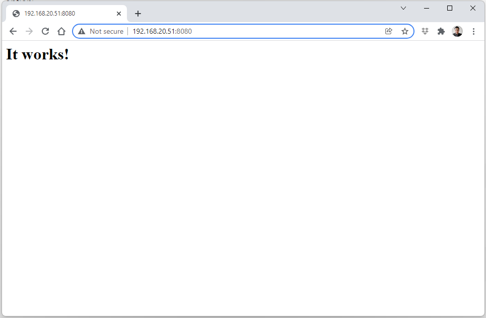

# Lectura 2 - El comando `docker run`

## Prerequisitos

Antes de comenzar, asegúrese de tener:

- Docker instalado y en ejecución 
- Permisos adecuados para ejecutar comandos Docker (usuario agregado al grupo `docker` o acceso root)
- Puertos 8080 y 5432 disponibles en su máquina
- Conocimientos básicos de línea de comandos
- Al menos 2 GB de espacio libre en disco

Para verificar su instalación:

```bash
docker --version
docker ps
```

## Introducción

En esta lectura se explorarán opciones adicionales del comando `docker run` para la ejecución de contenedores.

## Los tags

En Docker, los tags (etiquetas) son identificadores que se utilizan para diferenciar distintas versiones de una misma imagen. Un tag permite especificar exactamente qué versión de una imagen desea utilizar, lo cual es fundamental para garantizar la reproducibilidad y estabilidad de los entornos.

> [!WARNING]
> En entornos de producción, **siempre especifique versiones exactas** (e.g., `postgres:17.5` en lugar de `postgres:latest`) para garantizar reproducibilidad y evitar actualizaciones inesperadas.

Para iniciar, descargue la imagen `httpd` desde Docker Hub, la cual provee el servidor web Apache.

Utilice el siguiente comando `docker pull` para obtener la imagen:

```bash
docker pull httpd
```

Salida esperada:

```bash
jpadillaa@server % docker pull httpd
Using default tag: latest
latest: Pulling from library/httpd
efb5ed68baba: Pull complete 
ffd33a11623b: Pull complete 
4f4fb700ef54: Pull complete 
6215ae3139f0: Pull complete 
331fae7d537c: Pull complete 
Digest: sha256:f84fe51ff5d35124e024f51215b443b16c939b24eae747025a515200e71c7d07
Status: Downloaded newer image for httpd:latest
docker.io/library/httpd:latest
```

La salida `Using default tag: latest` confirma que, al no especificar una versión, se utilizó la etiqueta por defecto.

Como mencionamos previamente, un tag es un alias que identifica una versión específica de una imagen, permitiendo diferenciar entre variantes como `httpd:2.4` o `httpd:alpine`.

Cuando no se provee un tag, Docker usa `latest` de forma predeterminada. Este generalmente apunta a la versión estable más reciente, según lo define el mantenedor de la imagen. Para ver todas las etiquetas y versiones disponibles, consulte la documentación de la imagen en [Docker Hub](https://hub.docker.com/_/httpd).

Para obtener la versión más reciente de una imagen, puede omitir la etiqueta o usar explícitamente el tag `latest`.

La documentación de la imagen `httpd` indica que varios tags, como `2.4.66` y `trixie`, funcionan como alias que apuntan a la misma versión base.

> [!NOTE]
> Las versiones listadas a continuación corresponden a las disponibles al momento de escribir este tutorial (diciembre 2025). Para verificar las versiones más recientes y actualizadas de la imagen `httpd`, siempre consulte la [página oficial en Docker Hub](https://hub.docker.com/_/httpd/tags) antes de ejecutar los comandos.

Como resultado, cualquiera de los siguientes comandos descargará una única imagen. Ejecute el de su preferencia:

```bash
docker pull httpd
docker pull httpd:latest
docker pull httpd:2.4.66
docker pull httpd:2.4
docker pull httpd:2
docker pull httpd:2.4.66-trixie
docker pull httpd:2.4-trixie
docker pull httpd:2-trixie
docker pull httpd:trixie
```

Al listar las imágenes locales, se observa que no se descargó contenido nuevo. Múltiples nombres de imágenes pueden aparecer en la lista, pero todos comparten un único `IMAGE ID`, confirmando que los diferentes tags son alias para la misma imagen ya existente en el sistema.

```bash
jpadillaa@server % docker image ls
REPOSITORY   TAG       IMAGE ID       CREATED       SIZE
httpd        latest    f84fe51ff5d3   10 days ago   250MB

jpadillaa@server % docker pull httpd:2.4.66
2.4.64: Pulling from library/httpd
Digest: sha256:f84fe51ff5d35124e024f51215b443b16c939b24eae747025a515200e71c7d07
Status: Downloaded newer image for httpd:2.4.66
docker.io/library/httpd:2.4.66

jpadillaa@server % docker pull httpd:2.4
2.4: Pulling from library/httpd
Digest: sha256:f84fe51ff5d35124e024f51215b443b16c939b24eae747025a515200e71c7d07
Status: Downloaded newer image for httpd:2.4
docker.io/library/httpd:2.4

jpadillaa@server % docker pull httpd:2.4.66-trixie
2.4.66-trixie: Pulling from library/httpd
Digest: sha256:f84fe51ff5d35124e024f51215b443b16c939b24eae747025a515200e71c7d07
Status: Downloaded newer image for httpd:2.4.64-bookworm
docker.io/library/httpd:2.4.66-trixie

jpadillaa@server % docker pull httpd:2-trixie
2-bookworm: Pulling from library/httpd
Digest: sha256:f84fe51ff5d35124e024f51215b443b16c939b24eae747025a515200e71c7d07
Status: Downloaded newer image for httpd:2-bookworm
docker.io/library/httpd:2-trixie

jpadillaa@server % docker image ls                  
REPOSITORY   TAG               IMAGE ID       CREATED       SIZE
httpd        2-trixie          f84fe51ff5d3   10 days ago   250MB
httpd        2.4               f84fe51ff5d3   10 days ago   250MB
httpd        2.4.66            f84fe51ff5d3   10 days ago   250MB
httpd        2.4.66-trixie     f84fe51ff5d3   10 days ago   250MB
httpd        latest            f84fe51ff5d3   10 days ago   250MB
```

Ahora, descarguemos la otra versión de la imagen y validemos que el ID de la imagen es diferente:

```bash
docker pull httpd:2.4.52-alpine
```

Salida:

```bash
jpadillaa@server % docker pull httpd:2.4.52-alpine 
2.4.52-alpine: Pulling from library/httpd
15d45afd13ac: Pull complete 
55c32d614302: Pull complete 
f09380cbcdb7: Pull complete 
9b3977197b4f: Pull complete 
5d9e1f412841: Pull complete 
e5dbfbe5ef51: Pull complete 
Digest: sha256:c7b8040505e2e63eafc82d37148b687ff488bf6d25fc24c8bf01d71f5b457531
Status: Downloaded newer image for httpd:2.4.52-alpine
docker.io/library/httpd:2.4.52-alpine

jpadillaa@server % docker image ls
REPOSITORY   TAG               IMAGE ID       CREATED       SIZE
httpd        2-trixie          f84fe51ff5d3   10 days ago   250MB
httpd        2.4               f84fe51ff5d3   10 days ago   250MB
httpd        2.4.66            f84fe51ff5d3   10 days ago   250MB
httpd        2.4.66-trixie     f84fe51ff5d3   10 days ago   250MB
httpd        latest            f84fe51ff5d3   10 days ago   250MB
httpd        2.4.52-alpine     c7b8040505e2   3 years ago   82.8MB
```

> [!NOTE]
> La imagen Alpine es significativamente más pequeña (82.8MB vs 250MB) debido a que utiliza Alpine Linux como base, una distribución minimalista.

## Port mapping

El concepto de port mapping (mapeo de puertos) en Docker es fundamental porque permite exponer y acceder a los servicios que se ejecutan dentro de un contenedor desde el exterior, ya sea desde el host o desde otras redes. Por defecto, los contenedores Docker están aislados y sus servicios no son accesibles directamente fuera del entorno del contenedor. Mediante el mapeo de puertos, es posible redirigir el tráfico de un puerto específico del host hacia un puerto del contenedor donde se está ejecutando la aplicación. En resumen, el mapeo de puertos (port mapping) expone un proceso que se ejecuta dentro de un contenedor hacia el exterior.

Esto es especialmente importante para aplicaciones web, APIs, bases de datos u otros servicios que deben ser accesibles desde el exterior del contenedor. Por ejemplo, si ejecuta un servidor web dentro de un contenedor en el puerto 80, puede usar el mapeo de puertos para acceder a dicho servidor a través del puerto 8080 del host con el siguiente comando:

Para asignar un puerto al ejecutar un nuevo contenedor, utilice la opción `-p` en el comando `docker run`, especificando el puerto del host y el puerto del contenedor.

### Ejemplo básico

```bash
docker run -p 8080:80 --name servidor-web httpd
```

**Explicación:**
- `80` → Puerto donde Apache se ejecuta **dentro del contenedor**
- `8080` → Puerto en el **host** que redirige tráfico al puerto 80 del contenedor

Para verificar la configuración, abra un navegador web y acceda a `http://localhost:8080` o `http://<IP_DEL_HOST>:8080`.



> [!TIP]
> Use la opción `--rm` para contenedores de prueba que desea eliminar automáticamente al detenerse:
> ```bash
> docker run --rm -p 8080:80 --name servidor-web-test httpd
> ```

El port mapping es un concepto de red fundamental en Docker y puede considerarse análogo a las operaciones de NAT (Network Address Translation), ya que permite redirigir el tráfico de puertos del host hacia los puertos internos de los contenedores. Sin embargo, es importante resaltar que en Docker existen otros elementos de networking igualmente relevantes, como la creación y gestión de redes virtuales, el uso de alias y DNS internos, la configuración de políticas de firewall, la utilización de redes avanzadas (como overlay o macvlan) y la exposición de puertos mediante la instrucción `EXPOSE`. Conocer y explorar estos aspectos es esencial para dominar Docker en entornos de producción y construir infraestructuras seguras, escalables y eficientes.

## Volume mapping

Los volúmenes se utilizan para persistir y compartir datos entre los contenedores y el sistema anfitrión (host). Esto garantiza que la información permanezca intacta incluso si el contenedor se detiene o elimina. Esta técnica se conoce como mapeo de volúmenes (volume mapping).

### Tipos de volúmenes en Docker

Docker ofrece tres formas principales de persistir datos:

#### 1. Named Volumes (Volúmenes nombrados) - **Recomendado**

Administrados por Docker, son la forma más segura y portable de persistir datos.

```bash
docker run -d -v postgres-data:/var/lib/postgresql/data postgres:17.5
```

**Ventajas:**
- Docker gestiona la ubicación física
- Portabilidad entre sistemas
- Mejor rendimiento
- Fácil backup con `docker volume`

#### 2. Bind Mounts (Montajes vinculados)

Mapean un directorio específico del host al contenedor.

```bash
docker run -d -v /home/jpadillaa/postgres-data:/var/lib/postgresql/data postgres:17.5
```

**Ventajas:**
- Acceso directo desde el host
- Útil para desarrollo

**Desventajas:**
- Dependiente de la estructura del host
- Problemas de permisos potenciales

#### 3. tmpfs Mounts

Almacenamiento en memoria RAM (no persiste al reiniciar).

```bash
docker run -d --tmpfs /app/temp postgres:17.5
```

## Ejemplo: Persistencia de datos de PostgreSQL

Para ilustrar, se creará un contenedor para una base de datos PostgreSQL. El objetivo es almacenar los datos de la base de datos fuera del contenedor para asegurar su durabilidad.

### Opción 1: Usando Named Volume (Recomendado)

```bash
docker run -d \
  -p 5432:5432 \
  -e POSTGRES_PASSWORD=mysecret \
  -v postgres-data:/var/lib/postgresql/data \
  --name postgres-container \
  postgres:17.5
```

### Opción 2: Usando Bind Mount

```bash
docker run -d \
  -p 5432:5432 \
  -e POSTGRES_PASSWORD=mysecret \
  -v /home/jpadillaa/postgres-data:/var/lib/postgresql/data \
  --name postgres-container \
  postgres:17.5
```

> [!WARNING]
> Al usar bind mounts, asegúrese de que:
> - La ruta del host existe y tiene permisos adecuados
> - Use rutas **absolutas**, no relativas
> - El usuario que ejecuta Docker tiene permisos de escritura

**Explicación del comando:**

- `-d`: Ejecuta el contenedor en segundo plano (modo detached)
- `-p 5432:5432`: Mapea el puerto 5432 del host al puerto 5432 del contenedor para acceder al servidor de base de datos
- `-e POSTGRES_PASSWORD=mysecret`: Establece la contraseña `mysecret` para el usuario por defecto (`postgres`) del servidor de base de datos
- `-v postgres-data:/var/lib/postgresql/data`: Crea un volumen nombrado `postgres-data` y lo mapea al directorio `/var/lib/postgresql/data` dentro del contenedor, donde PostgreSQL almacena sus datos
- `--name postgres-container`: Asigna el nombre `postgres-container` al contenedor para facilitar su manejo
- `postgres:17.5`: Utiliza la imagen de PostgreSQL versión 17.5 (versión específica en lugar de `latest`)

### Verificación de persistencia de datos

Para verificar que el mapeo de volumen funciona correctamente, siga estos pasos:

#### 1. Conectarse a la base de datos y crear datos de prueba

```bash
# Conectarse al contenedor
docker exec -it postgres-container psql -U postgres

# Dentro de psql, ejecute:
CREATE DATABASE testdb;
\c testdb
CREATE TABLE usuarios (
  id SERIAL PRIMARY KEY,
  nombre VARCHAR(100),
  email VARCHAR(100)
);
INSERT INTO usuarios (nombre, email) VALUES 
  ('Juan Pérez', 'juan@example.com'),
  ('María García', 'maria@example.com');
SELECT * FROM usuarios;
\q
```

#### 2. Detener y eliminar el contenedor

```bash
docker stop postgres-container
docker rm postgres-container
```

#### 3. Recrear el contenedor con el mismo volumen

```bash
docker run -d \
  -p 5432:5432 \
  -e POSTGRES_PASSWORD=mysecret \
  -v postgres-data:/var/lib/postgresql/data \
  --name postgres-container \
  postgres:17.5
```

#### 4. Verificar que los datos persisten

```bash
docker exec -it postgres-container psql -U postgres -d testdb -c "SELECT * FROM usuarios;"
```

**Salida esperada:**

```
 id |    nombre     |       email        
----+---------------+--------------------
  1 | Juan Pérez    | juan@example.com
  2 | María García  | maria@example.com
(2 rows)
```

> [!NOTE]
> Los datos se conservaron porque el volumen `postgres-data` existe independientemente del contenedor. Docker automáticamente lo reconecta al nuevo contenedor.

### Gestión de volúmenes

```bash
# Listar volúmenes
docker volume ls

# Inspeccionar un volumen
docker volume inspect postgres-data

# Crear un volumen manualmente
docker volume create mi-volumen

# Eliminar un volumen (solo si no está en uso)
docker volume rm postgres-data

# Eliminar volúmenes no utilizados
docker volume prune
```

## Inspect

El comando `docker inspect` devuelve información detallada y de bajo nivel sobre objetos de Docker, como contenedores e imágenes.

Es una herramienta esencial para obtener datos específicos de configuración, como la dirección IP de un contenedor, sus mapeos de puertos o la ubicación de sus volúmenes. Con `docker inspect`, los desarrolladores e ingenieros pueden depurar y entender a fondo la configuración de sus componentes.

Para obtener la información, ejecute `docker inspect` seguido del nombre o ID del objeto que desea examinar.

### Sintaxis

```bash
# Para inspeccionar un contenedor
docker inspect nombre_del_contenedor

# Para inspeccionar una imagen
docker inspect nombre_de_la_imagen
```

El comando `docker inspect` genera una salida en formato JSON con información detallada del objeto.

Debido a que la salida puede ser extensa, es una práctica común redirigirla a un archivo para facilitar su análisis.

```bash
# Guardar la salida en un archivo
docker inspect postgres-container > salida_contenedor.json
```

> [!TIP]
> Use `jq` para filtrar información específica del JSON:
> ```bash
> # Obtener solo la dirección IP
> docker inspect postgres-container | jq '.[0].NetworkSettings.IPAddress'
> 
> # Obtener mapeos de puertos
> docker inspect postgres-container | jq '.[0].NetworkSettings.Ports'
> ```

### Ejemplo de salida

Una vez obtenida la salida del comando `docker inspect`, esta puede ser analizada para extraer información específica sobre el contenedor o la imagen.

```bash
jpadillaa@server % docker ps
CONTAINER ID   IMAGE             COMMAND                  CREATED         STATUS         PORTS                                         NAMES
3dc36fca5a24   postgres:17.5     "docker-entrypoint.s…"   6 seconds ago   Up 5 seconds   0.0.0.0:5432->5432/tcp, [::]:5432->5432/tcp   postgres-container
```

```bash
jpadillaa@server % docker inspect postgres-container
[
    {
        "Id": "3dc36fca5a24bd4b9b068d9d2d6e21fac8b1f0eda101c6b03467256e6a94e52c",
        "Created": "2025-07-20T23:43:43.576678047Z",
        "Path": "docker-entrypoint.sh",
        "Args": [
            "postgres"
        ],
        "State": {
            "Status": "running",
            "Running": true,
        },
        "Name": "/postgres-container",
        "HostConfig": {
            "NetworkMode": "bridge",
            "PortBindings": {
                "5432/tcp": [
                    {
                        "HostIp": "",
                        "HostPort": "5432"
                    }
                ]
            }
        },
        "Mounts": [
            {
                "Type": "volume",
                "Name": "postgres-data",
                "Source": "/var/lib/docker/volumes/postgres-data/_data",
                "Destination": "/var/lib/postgresql/data",
                "Driver": "local",
                "Mode": "z",
                "RW": true,
                "Propagation": ""
            }
        ],
        "Config": {
            "Env": [
                "POSTGRES_PASSWORD=mysecret",
                "PATH=/usr/local/sbin:/usr/local/bin:/usr/sbin:/usr/bin:/sbin:/bin:/usr/lib/postgresql/17/bin",
                "GOSU_VERSION=1.17",
                "LANG=en_US.utf8",
                "PG_MAJOR=17",
                "PG_VERSION=17.5-1.pgdg120+1",
                "PGDATA=/var/lib/postgresql/data"
            ],
            "Cmd": [
                "postgres"
            ],
            "Image": "postgres:17.5"
        },
        "NetworkSettings": {
            "Bridge": "",
            "Ports": {
                "5432/tcp": [
                    {
                        "HostIp": "0.0.0.0",
                        "HostPort": "5432"
                    },
                    {
                        "HostIp": "::",
                        "HostPort": "5432"
                    }
                ]
            },
            "Networks": {
                "bridge": {
                    "MacAddress": "a6:7b:6e:06:2a:cb",
                    "Gateway": "172.17.0.1",
                    "IPAddress": "172.17.0.2"
                }
            }
        }
    }
]
```

## Logs

El comando `docker logs` se utiliza para obtener los registros de un contenedor.

Este comando captura la salida estándar (STDOUT) y el error estándar (STDERR) de los procesos en ejecución, lo cual es fundamental para monitorear y depurar aplicaciones. Permite consultar registros históricos o seguir el flujo de logs en tiempo real.

Para usarlo, ejecute `docker logs` seguido del nombre o ID del contenedor.

### Sintaxis básica

```bash
docker logs nombre_del_contenedor
```

Por defecto, `docker logs` muestra los registros generados hasta el momento. Para ver los logs en tiempo real, utilice la opción `-f` o `--follow`.

```bash
# Seguir logs en tiempo real
docker logs -f nombre_del_contenedor

# Mostrar solo las últimas 100 líneas
docker logs --tail 100 nombre_del_contenedor

# Mostrar logs con timestamps
docker logs -t nombre_del_contenedor

# Combinar opciones
docker logs -f --tail 50 -t nombre_del_contenedor
```

### Ejemplo

```bash
jpadillaa@server % docker logs postgres-container
The files belonging to this database system will be owned by user "postgres".
This user must also own the server process.

The database cluster will be initialized with locale "en_US.utf8".
The default database encoding has accordingly been set to "UTF8".
The default text search configuration will be set to "english".

Data page checksums are disabled.

fixing permissions on existing directory /var/lib/postgresql/data ... ok
creating subdirectories ... ok
selecting dynamic shared memory implementation ... posix
selecting default "max_connections" ... 100
selecting default "shared_buffers" ... 128MB
selecting default time zone ... Etc/UTC
creating configuration files ... ok
running bootstrap script ... ok
performing post-bootstrap initialization ... ok
syncing data to disk ... ok
initdb: warning: enabling "trust" authentication for local connections
initdb: hint: You can change this by editing pg_hba.conf or using the option -A, or --auth-local and --auth-host, the next time you run initdb.

PostgreSQL init process complete; ready for start up.

2025-07-20 23:43:45.123 UTC [1] LOG:  starting PostgreSQL 17.5 on x86_64-pc-linux-gnu
2025-07-20 23:43:45.124 UTC [1] LOG:  listening on IPv4 address "0.0.0.0", port 5432
2025-07-20 23:43:45.124 UTC [1] LOG:  listening on IPv6 address "::", port 5432
2025-07-20 23:43:45.125 UTC [1] LOG:  database system is ready to accept connections
```

## Gestión de secrets

> [!WARNING]
> **Nunca exponga contraseñas directamente en comandos o código**. Las variables de entorno con `-e` son visibles en `docker inspect` y el historial de comandos.

### Alternativas seguras para manejar secrets

#### 1. Usando archivos de entorno (`.env`)

Cree un archivo `.env`:

```bash
# .env
POSTGRES_PASSWORD=mi_contraseña_segura
POSTGRES_USER=admin
POSTGRES_DB=produccion
```

Ejecute el contenedor:

```bash
docker run -d \
  -p 5432:5432 \
  --env-file .env \
  -v postgres-data:/var/lib/postgresql/data \
  --name postgres-container \
  postgres:17.5
```

**Importante:** Agregue `.env` a su `.gitignore`:

```bash
echo ".env" >> .gitignore
```

#### 2. Usando Docker Secrets (Docker Swarm)

Para entornos en producción con Docker Swarm:

```bash
# Crear un secret
echo "mi_contraseña_segura" | docker secret create postgres_password -

# Usar en un servicio
docker service create \
  --name postgres \
  --secret postgres_password \
  -e POSTGRES_PASSWORD_FILE=/run/secrets/postgres_password \
  postgres:17.5
```

#### 3. Usando variables de entorno del sistema

```bash
# Establecer la variable en el sistema
export POSTGRES_PASSWORD="mi_contraseña_segura"

# Usar en el comando
docker run -d \
  -p 5432:5432 \
  -e POSTGRES_PASSWORD="${POSTGRES_PASSWORD}" \
  -v postgres-data:/var/lib/postgresql/data \
  --name postgres-container \
  postgres:17.5
```

> [!TIP]
> En producción, considere usar herramientas de gestión de secrets como:
> - HashiCorp Vault
> - AWS Secrets Manager
> - Azure Key Vault
> - Kubernetes Secrets

## Limpieza y mantenimiento

Con el tiempo, Docker acumula imágenes, contenedores, volúmenes y redes no utilizados que ocupan espacio en disco.

### Comandos de limpieza

```bash
# Ver espacio usado por Docker
docker system df

# Eliminar contenedores detenidos
docker container prune

# Eliminar imágenes sin usar
docker image prune

# Eliminar imágenes sin tag
docker image prune -a

# Eliminar volúmenes no utilizados
docker volume prune

# Eliminar redes no utilizadas
docker network prune

# Limpieza completa (todo lo no usado)
docker system prune -a --volumes
```

> [!WARNING]
> `docker system prune -a --volumes` eliminará:
> - Todos los contenedores detenidos
> - Todas las imágenes sin contenedores asociados
> - Todos los volúmenes no montados
> - Todas las redes no utilizadas
> 
> Use con precaución y verifique antes de confirmar.

### Limpieza selectiva

```bash
# Eliminar contenedor específico
docker rm nombre_contenedor

# Forzar eliminación de contenedor en ejecución
docker rm -f nombre_contenedor

# Eliminar imagen específica
docker rmi nombre_imagen:tag

# Eliminar volumen específico
docker volume rm nombre_volumen
```

## Troubleshooting

### Problema 1: Puerto ya en uso

**Error:**
```
Error starting userland proxy: listen tcp4 0.0.0.0:5432: bind: address already in use
```

**Solución:**

```bash
# Verificar qué proceso usa el puerto
sudo lsof -i :5432
# o
sudo netstat -tulpn | grep 5432

# Detener el servicio conflictivo
sudo systemctl stop postgresql

# O usar un puerto diferente en el host
docker run -d -p 5433:5432 ... postgres:17.5
```

### Problema 2: Permisos en volúmenes (bind mounts)

**Error:**
```
Permission denied
```

**Solución:**

```bash
# Opción 1: Cambiar permisos del directorio
sudo chown -R 999:999 /home/jpadillaa/postgres-data

# Opción 2: Usar named volume en lugar de bind mount
docker run -d -v postgres-data:/var/lib/postgresql/data postgres:17.5
```

> [!NOTE]
> El usuario de PostgreSQL dentro del contenedor tiene UID 999. Asegúrese de que el directorio del host tenga los permisos correctos.

### Problema 3: Contenedor no inicia

**Diagnóstico:**

```bash
# Ver estado del contenedor
docker ps -a

# Ver logs del contenedor
docker logs nombre_contenedor

# Inspeccionar el contenedor
docker inspect nombre_contenedor

# Ver eventos de Docker
docker events
```

### Problema 4: Contenedor se detiene inmediatamente

**Causa común:** El comando principal del contenedor terminó.

**Diagnóstico:**

```bash
# Ver los últimos logs
docker logs --tail 50 nombre_contenedor

# Ejecutar en modo interactivo para depurar
docker run -it nombre_imagen /bin/bash
```

### Problema 5: No se puede conectar a la base de datos

**Verificaciones:**

```bash
# 1. Verificar que el contenedor está corriendo
docker ps | grep postgres

# 2. Verificar logs del contenedor
docker logs postgres-container

# 3. Verificar conectividad de red
docker exec postgres-container pg_isready -U postgres

# 4. Probar conexión desde el host
psql -h localhost -p 5432 -U postgres

# 5. Verificar puertos expuestos
docker port postgres-container
```

### Problema 6: Volumen lleno o corrupto

**Solución:**

```bash
# Hacer backup del volumen
docker run --rm -v postgres-data:/data -v $(pwd):/backup ubuntu tar cvf /backup/backup.tar /data

# Eliminar y recrear el volumen
docker volume rm postgres-data
docker volume create postgres-data

# Restaurar backup
docker run --rm -v postgres-data:/data -v $(pwd):/backup ubuntu tar xvf /backup/backup.tar -C /
```

## Referencias

- [Comando docker run](https://docs.docker.com/engine/reference/commandline/run/)
- [Comando docker inspect](https://docs.docker.com/engine/reference/commandline/inspect/)
- [Comando docker logs](https://docs.docker.com/engine/reference/commandline/logs/)
