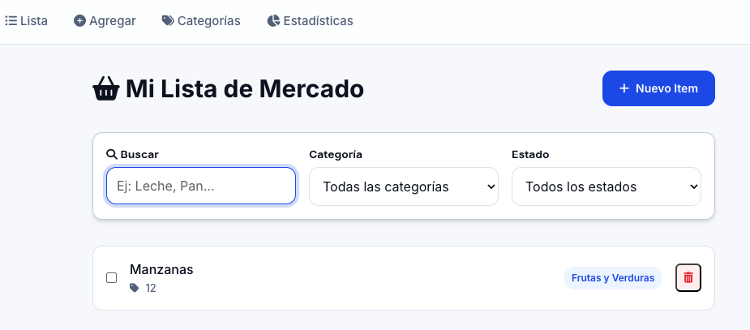

# Tutorial 02: Ejecución de contenedores Docker

> **Objetivo:**  Ejecutar contenedores Docker de forma correcta y reproducible, controlando puertos, volúmenes y variables de entorno para desplegar aplicaciones completas con un solo comando.

## Prerequisitos

Antes de comenzar, asegúrese de cumplir con los siguientes requisitos:

| Requisito | Verificación |
|-----------|--------------|
| Docker instalado | `docker --version` |
| Docker daemon en ejecución | `docker info` |
| Conexión a internet | Necesaria para descargar imágenes |
| Puerto 8080 disponible | `lsof -i :8080` (debe estar vacío) |
| Navegador web | Para acceder a la aplicación |

**Verificar instalación de Docker:**

```bash
docker --version
```

Salida esperada:
```
Docker version 24.0.x, build xxxxxxx
```

> [!WARNING]
> Si el comando `docker` no es reconocido o muestra errores de permisos, consulte la guía de instalación de Docker para su sistema operativo.

## Escenario

Descargue y ejecute la aplicación **Grocery List App** (una aplicación web para gestionar listas de compras) que ya está empaquetada como imagen Docker y disponible en Docker Hub.

Su tarea es:
1. Obtener la imagen desde el registro público
2. Ejecutar la aplicación en un contenedor
3. Verificar que la aplicación funciona correctamente
4. Documentar los comandos utilizados

**Imagen a utilizar:** `jpadillaa/grocerylistapp:latest`

## Procedimiento del laboratorio

### Parte 1: Preparación del entorno

#### Paso 1.1: Verificar el estado de Docker

Antes de comenzar, confirme que Docker está funcionando correctamente:

```bash
docker info
```

Debería ver información sobre el daemon de Docker, incluyendo el número de contenedores e imágenes.

#### Paso 1.2: Verificar imágenes locales

Liste las imágenes actualmente disponibles en su sistema:

```bash
docker images
```

> [!NOTE]
> Si es la primera vez que usa Docker, la lista probablemente estará vacía o solo mostrará algunas imágenes de prueba.

#### Paso 1.3: Verificar contenedores en ejecución

Confirme que no hay contenedores usando el puerto 8080:

```bash
docker ps
```

### Parte 2: Descarga de la imagen

#### Paso 2.1: Descargar la imagen desde Docker Hub

Ejecute el siguiente comando para descargar la imagen de la aplicación:

```bash
docker pull jpadillaa/grocerylistapp:latest
```

**Salida esperada:**

```
latest: Pulling from jpadillaa/grocerylistapp
a2abf6c4d29d: Pull complete 
c5608244554d: Pull complete 
2a13d2c24a3c: Pull complete 
3f4efb95c5e5: Pull complete 
Digest: sha256:xxxxxxxxxxxxxxxxxxxxxxxxxxxxxxxxx
Status: Downloaded newer image for jpadillaa/grocerylistapp:latest
docker.io/jpadillaa/grocerylistapp:latest
```

> [!TIP]
> Cada línea `Pull complete` representa una **capa** de la imagen que se descargó. Docker utiliza un sistema de capas para optimizar el almacenamiento y las descargas.

#### Paso 2.2: Verificar la descarga

Confirme que la imagen se descargó correctamente:

```bash
docker images
```

**Salida esperada:**

```
REPOSITORY                    TAG       IMAGE ID       CREATED        SIZE
jpadillaa/grocerylistapp      latest    xxxxxxxxxxxx   X days ago     XXX MB
```

✅ La imagen `jpadillaa/grocerylistapp:latest` aparece en la lista de imágenes locales.

### Parte 3: Ejecución del contenedor

#### Paso 3.1: Ejecutar el contenedor

Ahora ejecute la aplicación en un contenedor con el siguiente comando:

```bash
docker run -d -p 8080:8080 --name app jpadillaa/grocerylistapp:latest
```

**Salida esperada:**

```
a1b2c3d4e5f6g7h8i9j0k1l2m3n4o5p6q7r8s9t0u1v2w3x4y5z6a7b8c9d0e1f2
```

> [!NOTE]
> La cadena alfanumérica que se muestra es el **ID completo del contenedor**. Docker lo utiliza para identificar de forma única cada contenedor.

#### Paso 3.2: Entender el comando

Analicemos cada parte del comando ejecutado:

| Componente | Descripción |
|------------|-------------|
| `docker run` | Comando para crear y ejecutar un nuevo contenedor |
| `-d` | Ejecuta el contenedor en **modo detached** (segundo plano) |
| `-p 8080:8080` | Mapea el puerto 8080 del **host** al puerto 8080 del **contenedor** |
| `--name app` | Asigna el nombre "app" al contenedor para fácil identificación |
| `jpadillaa/grocerylistapp:latest` | Imagen a utilizar con su tag |

**Diagrama del mapeo de puertos:**

```
┌─────────────────────────────────────────────────────────────┐
│                        HOST (Su computadora)                │
│                                                             │
│    localhost:8080  ──────────────────┐                      │
│                                      │                      │
│         ┌────────────────────────────▼────────────────┐     │
│         │            CONTENEDOR "app"                 │     │
│         │                                             │     │
│         │    ┌─────────────────────────────────┐      │     │
│         │    │      Grocery List App           │      │     │
│         │    │      (escuchando en :8080)      │      │     │
│         │    └─────────────────────────────────┘      │     │
│         │                                             │     │
│         └─────────────────────────────────────────────┘     │
│                                                             │
└─────────────────────────────────────────────────────────────┘
```

#### Paso 3.3: Verificar que el contenedor está en ejecución

Liste los contenedores activos:

```bash
docker ps
```

**Salida esperada:**

```
CONTAINER ID   IMAGE                              COMMAND                  CREATED          STATUS          PORTS                    NAMES
a1b2c3d4e5f6   jpadillaa/grocerylistapp:latest   "java -jar /app/app.…"   10 seconds ago   Up 9 seconds    0.0.0.0:8080->8080/tcp   app
```

**Interpretación de la salida:**

| Columna | Significado |
|---------|-------------|
| `CONTAINER ID` | Identificador único del contenedor (versión corta) |
| `IMAGE` | Imagen utilizada para crear el contenedor |
| `COMMAND` | Comando que se ejecuta dentro del contenedor |
| `CREATED` | Tiempo transcurrido desde la creación |
| `STATUS` | Estado actual (`Up` = en ejecución) |
| `PORTS` | Mapeo de puertos (host → contenedor) |
| `NAMES` | Nombre asignado al contenedor |

✅ El contenedor "app" aparece con estado "Up" y el puerto 8080 mapeado.

### Parte 4: Verificación de la aplicación

#### Paso 4.1: Acceder desde el navegador

Abra su navegador web y acceda a:

```
http://localhost:8080
```

Debería ver la interfaz de la aplicación **Grocery List App**.



#### Paso 4.2: Probar la aplicación

Realice las siguientes acciones para verificar que la aplicación funciona:

1. Agregue un nuevo ítem a la lista (ejemplo: "Manzanas")
2. Agregue otro ítem (ejemplo: "Leche")
3. Marque un ítem como completado
4. Elimine un ítem de la lista

> [!TIP]
> Si la aplicación no carga, verifique los logs del contenedor con `docker logs app` para identificar posibles errores.

#### Paso 4.3: Verificar conectividad (alternativa por terminal)

Si no tiene acceso a un navegador gráfico, puede verificar la aplicación desde la terminal:

```bash
curl http://localhost:8080
```

O verificar solo que el puerto responde:

```bash
curl -I http://localhost:8080
```

**Salida esperada:**

```
HTTP/1.1 200 OK
Server: gunicorn
Date: Mon, 22 Dec 2025 23:51:16 GMT
Connection: close
Content-Type: text/html; charset=utf-8
Content-Length: 2291
...
```

✅ La aplicación responde correctamente en el puerto 8080.

### Parte 5: Exploración del contenedor

#### Paso 5.1: Ver los logs del contenedor

Examine los registros (logs) generados por la aplicación:

```bash
docker logs app
```

Este comando muestra la salida estándar (stdout) y errores (stderr) del proceso principal.

#### Paso 5.2: Ver logs en tiempo real

Para seguir los logs en tiempo real (útil para debugging):

```bash
docker logs -f app
```

> [!NOTE]
> Presione `Ctrl + C` para salir del modo de seguimiento de logs.

#### Paso 5.3: Inspeccionar el contenedor

Obtenga información detallada sobre el contenedor:

```bash
docker inspect app
```

Para ver información específica, use filtros:

```bash
# Ver la dirección IP del contenedor
docker inspect -f '{{range .NetworkSettings.Networks}}{{.IPAddress}}{{end}}' app

# Ver las variables de entorno
docker inspect -f '{{range .Config.Env}}{{println .}}{{end}}' app

# Ver el estado del contenedor
docker inspect -f '{{.State.Status}}' app
```

#### Paso 5.4: Ver uso de recursos

Monitoree el consumo de CPU y memoria del contenedor:

```bash
docker stats app --no-stream
```

**Salida esperada:**

```
CONTAINER ID   NAME   CPU %     MEM USAGE / LIMIT     MEM %     NET I/O           BLOCK I/O   PIDS
a1b2c3d4e5f6   app    0.15%     150MiB / 7.5GiB       2.00%     1.5kB / 1.2kB     0B / 0B     25
```

### Parte 6: Gestión del contenedor

#### Paso 6.1: Detener el contenedor

Detenga el contenedor de forma ordenada:

```bash
docker stop app
```

**Salida esperada:**

```
app
```

Verifique que el contenedor ya no está en ejecución:

```bash
docker ps
```

La lista debería estar vacía o no mostrar el contenedor "app".

#### Paso 6.2: Ver contenedores detenidos

Para ver todos los contenedores (incluyendo los detenidos):

```bash
docker ps -a
```

**Salida esperada:**

```
CONTAINER ID   IMAGE                              COMMAND                  CREATED          STATUS                     PORTS   NAMES
a1b2c3d4e5f6   jpadillaa/grocerylistapp:latest   "java -jar /app/app.…"   5 minutes ago    Exited (143) 1 minute ago          app
```

> [!NOTE]
> El estado cambió de `Up` a `Exited`. El código de salida `143` indica que el contenedor fue detenido con la señal SIGTERM (terminación ordenada).

#### Paso 6.3: Reiniciar el contenedor

Vuelva a iniciar el contenedor detenido:

```bash
docker start app
```

Verifique que está en ejecución:

```bash
docker ps
```

✅ La aplicación debería estar disponible nuevamente en `http://localhost:8080`.

#### Paso 6.4: Reiniciar el contenedor (restart)

Para reiniciar un contenedor en ejecución (stop + start):

```bash
docker restart app
```

### Parte 7: Limpieza

#### Paso 7.1: Detener el contenedor

```bash
docker stop app
```

#### Paso 7.2: Eliminar el contenedor

```bash
docker rm app
```

**Salida esperada:**

```
app
```

Verifique que el contenedor fue eliminado:

```bash
docker ps -a
```

El contenedor "app" ya no debería aparecer en la lista.

#### Paso 7.3: Eliminar la imagen (opcional)

Si desea liberar espacio en disco, puede eliminar la imagen:

```bash
docker rmi jpadillaa/grocerylistapp:latest
```

> [!WARNING]
> Solo elimine la imagen si no la va a utilizar próximamente. De lo contrario, deberá descargarla nuevamente.


## Ejercicios adicionales

Complete los siguientes ejercicios para reforzar su aprendizaje:

### Ejercicio 1: Cambiar el puerto del host

Ejecute el contenedor mapeando la aplicación al puerto **3000** del host en lugar del 8080.

<details>
<summary>💡 Ver solución</summary>

```bash
docker run -d -p 3000:8080 --name app-puerto3000 jpadillaa/grocerylistapp:latest
```

Acceda a la aplicación en: `http://localhost:3000`

</details>


### Ejercicio 2: Ejecutar en primer plano

Ejecute el contenedor **sin** la opción `-d` para ver los logs directamente en la terminal.

<details>
<summary>💡 Ver solución</summary>

```bash
docker run -p 8080:8080 --name app-foreground jpadillaa/grocerylistapp:latest
```

> Nota: Deberá presionar `Ctrl + C` para detener el contenedor. Use `--rm` para eliminarlo automáticamente al detenerse:
> ```bash
> docker run --rm -p 8080:8080 --name app-foreground jpadillaa/grocerylistapp:latest
> ```

</details>


### Ejercicio 3: Ejecutar múltiples instancias

Ejecute **dos instancias** de la aplicación simultáneamente en diferentes puertos.

<details>
<summary>💡 Ver solución</summary>

```bash
# Primera instancia en puerto 8081
docker run -d -p 8081:8080 --name app-1 jpadillaa/grocerylistapp:latest

# Segunda instancia en puerto 8082
docker run -d -p 8082:8080 --name app-2 jpadillaa/grocerylistapp:latest

# Verificar ambas instancias
docker ps
```

Acceda a:
- Instancia 1: `http://localhost:8081`
- Instancia 2: `http://localhost:8082`

</details>

### Ejercicio 4: Contenedor con eliminación automática

Ejecute el contenedor con la opción que lo elimina automáticamente al detenerse.

<details>
<summary>💡 Ver solución</summary>

```bash
docker run --rm -d -p 8080:8080 --name app-temporal jpadillaa/grocerylistapp:latest
```

Al ejecutar `docker stop app-temporal`, el contenedor se eliminará automáticamente.

Verifique con:
```bash
docker stop app-temporal
docker ps -a | grep app-temporal  # No debería aparecer
```

</details>

### Ejercicio 5: Ejecutar comando dentro del contenedor

Acceda al shell del contenedor en ejecución y explore el sistema de archivos.

<details>
<summary>💡 Ver solución</summary>

```bash
# Primero, asegúrese de que el contenedor está corriendo
docker run -d -p 8080:8080 --name app jpadillaa/grocerylistapp:latest

# Acceder al shell del contenedor
docker exec -it app /bin/sh

# Dentro del contenedor, explore:
ls -la /app
cat /etc/os-release
exit
```

</details>

## ❓ Preguntas de reflexión

Responda las siguientes preguntas para consolidar su comprensión:

1. **¿Qué sucede si intenta ejecutar `docker run` con un nombre de contenedor que ya existe?**

<details>
<summary>Ver respuesta</summary>

Docker mostrará un error indicando que el nombre ya está en uso:
```
docker: Error response from daemon: Conflict. The container name "/app" is already in use by container "abc123...".
```

Debe eliminar el contenedor existente (`docker rm app`) o usar un nombre diferente.

</details>

2. **¿Cuál es la diferencia entre `docker stop` y `docker kill`?**

<details>
<summary>Ver respuesta</summary>

- `docker stop`: Envía la señal **SIGTERM** al proceso principal, permitiendo una terminación ordenada (graceful shutdown). Espera 10 segundos por defecto antes de enviar SIGKILL.
- `docker kill`: Envía la señal **SIGKILL** inmediatamente, forzando la terminación abrupta del proceso sin tiempo para limpieza.

</details>

3. **¿Por qué es necesario el flag `-p 8080:8080`?**

<details>
<summary>Ver respuesta</summary>

Por defecto, los contenedores están aislados de la red del host. El flag `-p` (publish) crea un mapeo de puertos que permite que el tráfico del puerto 8080 del host sea redirigido al puerto 8080 del contenedor, haciendo la aplicación accesible desde fuera del contenedor.

</details>

4. **¿Qué ocurre con los datos de la aplicación cuando se elimina el contenedor?**

<details>
<summary>Ver respuesta</summary>

**Se pierden.** Los datos almacenados dentro del contenedor son efímeros y se eliminan junto con el contenedor. Para persistir datos, es necesario usar **volúmenes** (`-v` o `--mount`), que se estudiarán en laboratorios posteriores.

</details>

5. **¿Cuál es la ventaja de usar `--name` al ejecutar un contenedor?**

<details>
<summary>Ver respuesta</summary>

Asignar un nombre personalizado facilita:
- Identificar el contenedor en listados (`docker ps`)
- Referenciar el contenedor en otros comandos (`docker logs app`, `docker stop app`)
- Evitar usar el ID del contenedor (largo y difícil de recordar)
- Crear referencias predecibles para scripts y automatización

</details>

## Resumen de comandos

| Comando | Descripción |
|---------|-------------|
| `docker pull <imagen>` | Descarga una imagen desde un registro |
| `docker images` | Lista las imágenes locales |
| `docker run -d -p <host>:<cont> --name <nombre> <imagen>` | Ejecuta un contenedor |
| `docker ps` | Lista contenedores en ejecución |
| `docker ps -a` | Lista todos los contenedores |
| `docker logs <nombre>` | Muestra los logs del contenedor |
| `docker logs -f <nombre>` | Sigue los logs en tiempo real |
| `docker stop <nombre>` | Detiene un contenedor |
| `docker start <nombre>` | Inicia un contenedor detenido |
| `docker restart <nombre>` | Reinicia un contenedor |
| `docker rm <nombre>` | Elimina un contenedor |
| `docker rmi <imagen>` | Elimina una imagen |
| `docker inspect <nombre>` | Muestra información detallada |
| `docker stats <nombre>` | Muestra uso de recursos |
| `docker exec -it <nombre> <cmd>` | Ejecuta un comando en el contenedor |

## Recursos adicionales

- [Docker Run Reference](https://docs.docker.com/engine/reference/run/)
- [Docker Hub](https://hub.docker.com/)
