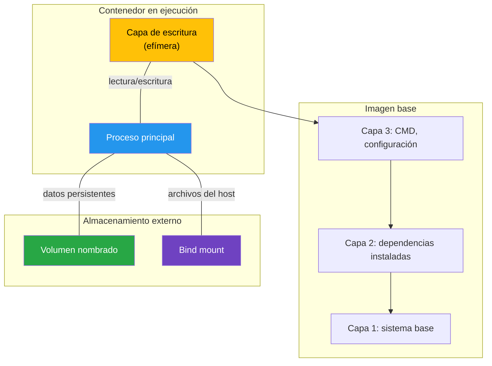

# Lectura 03 - Persistencia y configuración en aplicaciones compuestas

## Prerrequisitos

Esta lectura asume que el estudiante:

- comprende los conceptos de imagen, contenedor, red y volumen en Docker
- ha trabajado con `docker run`, incluyendo opciones como `-d`, `-p`, `-v`, `-e` y `--name`
- ha definido y operado aplicaciones multicontenedor con Docker Compose
- entiende el modelo de red de Docker y la comunicación entre servicios por nombre
- maneja la terminal en un entorno Linux o equivalente

## Introducción

Las lecturas anteriores presentaron la forma de definir una aplicación multicontenedor con Docker Compose y la manera en que sus servicios se comunican a través de redes Docker. En ambos casos, se emplearon volúmenes y variables de entorno con un propósito práctico, aunque sin profundizar todavía en las decisiones de diseño que justifican su uso.

Esta lectura se centra en dos preguntas fundamentales para cualquier aplicación compuesta.

- ¿Dónde deben persistir los datos que no pueden perderse?
- ¿Cómo recibe cada servicio su configuración sin incorporarla de manera rígida en la imagen?

Estas preguntas conducen a un principio de diseño esencial en el trabajo con contenedores, la separación entre imagen, datos y configuración. La imagen define qué se ejecuta. Los volúmenes determinan dónde persisten los datos. Las variables de entorno establecen cómo se configura cada instancia. Cuando estos tres elementos se gestionan de manera independiente, la aplicación adquiere mejores propiedades de portabilidad, reproducibilidad y operación en distintos ambientes, sin necesidad de modificar la imagen.

## Motivación

Una aplicación en operación produce y consume datos que exceden el ciclo de vida de un contenedor individual. Entre ellos se encuentran, por ejemplo, los siguientes elementos.

- Registros almacenados en una base de datos relacional
- Archivos cargados por los usuarios, como imágenes o documentos
- Estado asociado a una cola de mensajes o a un servicio de caché con mecanismos de persistencia
- Certificados TLS y archivos de configuración específicos de cada entorno

Si estos datos residen únicamente en el sistema de archivos interno del contenedor, se perderán cuando este sea eliminado o recreado. Esta situación no es excepcional. Por el contrario, hace parte del comportamiento normal en flujos de desarrollo, prueba y despliegue.

### La configuración no debe quedar incorporada en la imagen

Una imagen Docker debe ser agnóstica al entorno en el que se ejecuta. Idealmente, la misma imagen debe poder utilizarse en desarrollo, pruebas y producción. Lo que varía entre estos ambientes no es el código, sino la configuración operacional de la aplicación.

- Cadenas de conexión a bases de datos
- Credenciales de acceso
- Puertos de escucha
- Niveles de registro
- URL de servicios externos

Cuando esta información se incorpora directamente en el `Dockerfile` o en el código fuente, la imagen pierde portabilidad y se convierte en un artefacto acoplado a un entorno particular.

> [!IMPORTANT]
> La separación entre imagen, datos y configuración no constituye una recomendación opcional. Es una condición práctica para operar contenedores de forma reproducible en múltiples ambientes.

## Persistencia de datos en contenedores

### Naturaleza transitoria del contenedor

Un contenedor Docker es, por diseño, una unidad de ejecución transitoria y reemplazable. Puede crearse, ejecutarse, detenerse, eliminarse y reconstruirse múltiples veces a partir de una misma imagen. Cada nueva instancia inicia desde un estado limpio, definido por la imagen de origen.

Desde la perspectiva del almacenamiento, el sistema de archivos de un contenedor integra dos elementos principales.

1. Capas de solo lectura heredadas de la imagen
2. Una capa de escritura propia del contenedor, en la que se registran los cambios realizados durante su ejecución

Cuando el contenedor se elimina, su capa de escritura también desaparece. En consecuencia, todo lo almacenado exclusivamente en esa capa se pierde. Esto incluye, por ejemplo, archivos creados en tiempo de ejecución, datos persistidos localmente y registros generados por la aplicación.



### Qué ocurre al recrear un contenedor

Un ciclo común en desarrollo con Compose es:

```bash
$ docker compose down
$ docker compose up -d
```

Al ejecutar `docker compose down`, los contenedores se eliminan junto con sus capas de escritura. Posteriormente, al ejecutar `docker compose up`, Docker Compose crea nuevas instancias a partir de las imágenes definidas. En consecuencia, cualquier dato almacenado exclusivamente en la capa de escritura del contenedor se pierde.

No obstante, los **volúmenes nombrados** declarados en `docker-compose.yml` no siguen ese mismo ciclo de vida. Los datos montados sobre un volumen permanecen disponibles entre ejecuciones sucesivas de `down` y `up`. Esta es la función central de los volúmenes en Docker, desacoplar la persistencia del dato respecto del ciclo de vida del contenedor y permitir que la aplicación conserve estado aun cuando sus contenedores sean reemplazados.

> [!WARNING]
> El comando `docker compose down -v` elimina tanto los contenedores como los volúmenes nombrados asociados al proyecto. Su uso implica la destrucción de los datos persistidos en dichos volúmenes. Debe utilizarse únicamente cuando se requiera reiniciar por completo el estado de la aplicación.

### Por qué la naturaleza efímera del contenedor resulta útil

La naturaleza efímera de los contenedores no constituye una limitación del modelo, sino una decisión de diseño con implicaciones operativas valiosas.

- **Reproducibilidad**. Cada contenedor inicia desde un estado conocido y controlado.
- **Inmutabilidad**. Los artefactos de despliegue se reemplazan en lugar de modificarse manualmente en ejecución.
- **Escalabilidad**. Es posible crear nuevas instancias sin depender de estado residual de ejecuciones previas.
- **Aislamiento**. Un contenedor con fallas puede eliminarse y reconstruirse sin comprometer directamente a los demás.

La implicación de este enfoque es clara. Todo dato que deba sobrevivir al ciclo de vida del contenedor requiere una estrategia explícita de persistencia.

## Persistencia en Docker con volúmenes y bind mounts

Docker ofrece dos mecanismos principales para persistir datos por fuera de la capa de escritura del contenedor, los **volúmenes nombrados** (*named volumes*) y los bind mounts. Ambos permiten desacoplar el almacenamiento del ciclo de vida del contenedor, aunque responden a necesidades distintas y presentan implicaciones operativas diferentes.

### Volúmenes nombrados

Un volumen nombrado es un recurso de almacenamiento administrado por Docker. Su creación, inspección y eliminación se realiza mediante comandos del propio ecosistema Docker, mientras que su ubicación física en el host es gestionada internamente por el motor. Esta abstracción simplifica la administración del almacenamiento y reduce el acoplamiento directo entre la aplicación y la estructura del sistema de archivos del host.

```bash
# Crear un volumen
$ docker volume create mis-datos

# Listar volúmenes
$ docker volume ls

# Inspeccionar un volumen
$ docker volume inspect mis-datos

# Eliminar un volumen
$ docker volume rm mis-datos
```

Al montar un volumen en un contenedor, toda la información escrita en la ruta de montaje se almacena en el volumen y no en la capa de escritura del contenedor. Por esta razón, si el contenedor se elimina y posteriormente se crea uno nuevo con el mismo volumen asociado a la misma ruta, los datos permanecen disponibles.

Esta propiedad convierte a los volúmenes en el mecanismo habitual para conservar estado en aplicaciones contenedorizadas, especialmente cuando se requiere persistencia entre reinicios, recreaciones o actualizaciones de contenedores.

### Bind mounts

Un **bind mount** vincula un directorio o archivo específico del host con una ruta del sistema de archivos del contenedor. A diferencia de un volumen nombrado, no se trata de un recurso administrado por Docker, sino de una referencia directa a una ubicación concreta del sistema operativo anfitrión.

Esta característica ofrece mayor control sobre la ruta utilizada, pero también introduce un nivel más alto de acoplamiento con la estructura del host. En consecuencia, su uso exige mayor atención a aspectos como portabilidad, permisos y consistencia entre ambientes.

```bash
# Montar el directorio actual en /app dentro del contenedor
$ docker run -v $(pwd)/src:/app/src mi-imagen
```

En Compose, la sintaxis es equivalente:

```yaml
volumes:
  - ./src:/app/src
```

### Comparación entre mecanismos de almacenamiento

| Característica | Volumen nombrado | *Bind mount* | Capa de escritura del contenedor |
|---|---|---|---|
| Gestión | Administrado por Docker | No administrado por Docker | Administrada por Docker |
| Ubicación en el host | Definida internamente por Docker | Ruta explícita definida por el usuario | Asociada internamente al contenedor |
| Persistencia tras `docker compose down` | Sí | Sí, porque los archivos permanecen en el host | No |
| Persistencia tras `docker compose down -v` | No | Sí | No |
| Portabilidad entre hosts | Alta | Baja | No aplica |
| Desempeño | Generalmente alto en Linux y adecuado en otros sistemas operativos | Variable según el sistema operativo y la forma de acceso al host | Alto |
| Uso principal | Datos con estado, como bases de datos o archivos cargados por usuarios | Desarrollo y sincronización de archivos del host con el contenedor | Datos transitorios generados durante la ejecución |

> [!TIP]
> Como criterio práctico, conviene utilizar un **volumen nombrado** cuando el dato debe persistir más allá del ciclo de vida de cualquier contenedor y mantenerse desacoplado de la estructura del host. En cambio, un **bind mount** resulta más apropiado cuando se requiere que el contenedor refleje de manera inmediata los cambios realizados sobre archivos ubicados en la máquina anfitriona.

### Cuándo utilizar cada mecanismo

#### Volúmenes nombrados

Los volúmenes nombrados son apropiados cuando se requiere conservar datos de forma persistente, desacoplados del ciclo de vida del contenedor y sin necesidad de manipularlos directamente desde el host. Este mecanismo resulta especialmente adecuado en escenarios como los siguientes.

- Datos de bases de datos, por ejemplo en rutas como `/var/lib/postgresql/data` o `/var/lib/mysql`
- Archivos cargados por usuarios que deben mantenerse disponibles entre reinicios o recreaciones
- Estado de servicios como Redis cuando se ha habilitado persistencia
- Cualquier dato que deba sobrevivir a la recreación del contenedor y que no requiera edición directa desde la máquina anfitriona

#### Bind mounts

Los bind mounts son más convenientes cuando se necesita una relación directa entre archivos del host y archivos del contenedor. Su uso es frecuente en actividades de desarrollo, depuración y ajuste local de configuraciones.

- Código fuente durante el desarrollo, de modo que los cambios se reflejen sin reconstruir la imagen
- Archivos de configuración específicos del entorno local, como `nginx.conf`
- Cualquier archivo que el desarrollador necesite editar desde el host y observar de inmediato dentro del contenedor

#### Capa de escritura del contenedor

La capa de escritura del contenedor es suficiente para información transitoria que no necesita persistir una vez finaliza la vida útil de la instancia.

- Archivos temporales generados durante la ejecución
- Cachés de proceso que no requieren persistencia
- Registros enviados a `stdout` o `stderr` y recuperados posteriormente mediante `docker logs`

## Tipos de datos y estrategias de persistencia

No todos los datos de una aplicación exigen la misma estrategia de almacenamiento. Una clasificación pedagógica permite razonar con mayor claridad sobre qué debe persistir, qué puede ser transitorio y qué mecanismo conviene utilizar en cada caso.

| Categoría | Ejemplos | Estrategia recomendada |
|---|---|---|
| **Datos de negocio** | Registros en bases de datos, archivos de usuarios, transacciones | Volumen nombrado |
| **Datos operativos** | Registros persistentes, métricas, respaldos | Volumen nombrado o *bind mount*, según el caso |
| **Archivos de desarrollo** | Código fuente, configuración local, scripts de prueba | *Bind mount* |
| **Datos temporales** | Caché de proceso, archivos de sesión, compilaciones intermedias | Capa de escritura del contenedor |

> [!NOTE]
> Esta clasificación no debe interpretarse como una taxonomía rígida. Su propósito es orientar decisiones de diseño más conscientes sobre qué datos deben persistir, dónde conviene almacenarlos y bajo qué criterio técnico hacerlo.

## Volúmenes en Docker Compose

### Declaración y asociación de volúmenes nombrados

En un archivo `docker-compose.yml`, los volúmenes nombrados se definen en dos niveles complementarios.

1. **Nivel superior**  
   Allí se declara el volumen como un recurso propio del proyecto.

2. **Nivel de servicio**  
   Allí se asocia el volumen con una ruta específica dentro del contenedor.

Esta separación permite distinguir con claridad entre la existencia del recurso de almacenamiento y su uso concreto por parte de uno o varios servicios. Desde el punto de vista del diseño, esta organización hace más explícita la relación entre persistencia y arquitectura de la aplicación.

```yaml
services:
  db:
    image: postgres:16
    volumes:
      - pgdata:/var/lib/postgresql/data    # volumen nombrado

volumes:
  pgdata:                                   # declaración del volumen
```

### Reutilización al recrear contenedores

Cuando se ejecuta `docker compose down` seguido de `docker compose up -d`, los contenedores se eliminan y recrean, pero el volumen `pgdata` permanece. El nuevo contenedor de PostgreSQL monta el mismo volumen y encuentra los datos intactos.

```bash
# Levantar y generar datos
$ docker compose up -d
$ docker compose exec db psql -U app -d midb -c "INSERT INTO tabla VALUES (1, 'dato');"

# Destruir contenedores (sin -v)
$ docker compose down

# Recrear contenedores
$ docker compose up -d

# Los datos persisten
$ docker compose exec db psql -U app -d midb -c "SELECT * FROM tabla;"
```

### Inspección de volúmenes

```bash
# Listar volúmenes del sistema
$ docker volume ls

# Inspeccionar un volumen específico
$ docker volume inspect mi-proyecto_pgdata
```

La salida de `inspect` muestra la ubicación física del volumen en el host (generalmente bajo `/var/lib/docker/volumes/`), la fecha de creación y el driver utilizado.

### Impacto de `down -v`

```bash
# Elimina contenedores, redes Y volúmenes nombrados
$ docker compose down -v
```

Después de ejecutar este comando, el volumen `pgdata` deja de existir. En consecuencia, al iniciar nuevamente el entorno con `docker compose up -d`, PostgreSQL arranca con una base de datos vacía.

> [!CAUTION]
> Ejecute `docker compose down -v` únicamente cuando exista la intención explícita de eliminar todos los datos persistentes del proyecto. No debe utilizarse como equivalente de reiniciar la aplicación.

## Bind mounts en Docker Compose

### Sintaxis

En `docker-compose.yml`, un bind mount se distingue de un volumen nombrado por usar una **ruta relativa o absoluta** en el lado izquierdo del mapeo:

```yaml
services:
  app:
    volumes:
      - ./src:/app/src          # bind mount (ruta relativa)
      - /etc/localtime:/etc/localtime:ro   # bind mount (ruta absoluta, solo lectura)
      - appdata:/app/data       # volumen nombrado

volumes:
  appdata:
```

La sintaxis `HOST:CONTENEDOR` indica que una ruta del sistema anfitrión se monta en una ruta específica dentro del contenedor. Por su parte, el sufijo `:ro` establece que el montaje se realiza en modo de solo lectura, por lo que el contenedor puede acceder al contenido, pero no modificarlo.

### Caso de uso: desarrollo con recarga en vivo

Uno de los usos más comunes de los bind mounts consiste en montar el código fuente durante la etapa de desarrollo. Esto permite editar los archivos directamente en el host y observar esos cambios de manera inmediata dentro del contenedor, sin necesidad de reconstruir la imagen en cada modificación.

Esta práctica favorece ciclos de trabajo más ágiles y reduce la fricción durante actividades de implementación, prueba y depuración.

```yaml
services:
  app:
    build: .
    volumes:
      - ./app:/app        # el código fuente se monta desde el host
    ports:
      - "8000:8000"
```

Con esta configuración, si el framework utilizado por la aplicación soporta recarga automática (*hot reload*), cada cambio guardado en el editor se refleja de forma inmediata dentro del contenedor.

### Riesgos y limitaciones

- **Permisos**. El proceso que se ejecuta dentro del contenedor puede utilizar un UID distinto al del usuario en el host. Si los permisos del directorio montado no son compatibles, el contenedor podría no tener capacidad para leer o escribir archivos.

- **Portabilidad**. Un *bind mount* depende de la estructura del sistema de archivos del host. Un directorio disponible en la máquina de un desarrollador puede no existir en la de otro, lo que reduce la reproducibilidad entre ambientes locales.

- **Rendimiento**. En macOS y Windows, los bind mounts pueden introducir latencias apreciables en operaciones intensivas de entrada y salida, debido a la capa de traducción entre el sistema de archivos del host y el del contenedor.

- **Seguridad**. Un *bind mount* con permisos de escritura permite que el contenedor modifique archivos del host. En consecuencia, un error de configuración o de aplicación podría sobrescribir o eliminar archivos fuera del contenedor.

> [!WARNING]
> No utilice bind mounts como mecanismo principal de persistencia para datos de producción. Aunque son especialmente útiles en desarrollo por la rapidez de iteración que ofrecen, también introducen un mayor acoplamiento con el host. Para datos con estado en ambientes controlados, conviene preferir volúmenes nombrados.

## Configuración con variables de entorno

### Principio: la imagen no debe contener configuración de ambiente

Una imagen Docker bien diseñada debe concebirse como un artefacto inmutable. Idealmente, la misma imagen debe poder ejecutarse en desarrollo, pruebas y producción. Lo que cambia entre estos ambientes no es la imagen en sí, sino la **configuración inyectada en el momento de la ejecución**, principalmente mediante variables de entorno.

### Definición en `docker-compose.yml`

La directiva `environment` permite definir variables de entorno directamente en el archivo Compose:

```yaml
services:
  app:
    environment:
      - DATABASE_URL=postgresql://app:secreto@db:5432/midb
      - LOG_LEVEL=debug
      - PORT=8000
```

Cada variable se establece en formato `NOMBRE=VALOR` y está disponible para el proceso dentro del contenedor.

### Configuración de entorno mediante archivos `.env`

Docker Compose lee automáticamente un archivo `.env` en el mismo directorio que `docker-compose.yml`. Las variables definidas allí pueden referenciarse con la sintaxis `${VARIABLE}`:

#### Archivo `.env`

```dotenv
POSTGRES_USER=app
POSTGRES_PASSWORD=secreto123
POSTGRES_DB=midb
APP_PORT=8000
```

#### Archivo `docker-compose.yml`

```yaml
services:
  app:
    ports:
      - "${APP_PORT}:8000"
    environment:
      - DATABASE_URL=postgresql://${POSTGRES_USER}:${POSTGRES_PASSWORD}@db:5432/${POSTGRES_DB}

  db:
    image: postgres:16
    environment:
      - POSTGRES_USER=${POSTGRES_USER}
      - POSTGRES_PASSWORD=${POSTGRES_PASSWORD}
      - POSTGRES_DB=${POSTGRES_DB}
```

Esta separación permite que `docker-compose.yml` sea un archivo versionable y genérico, mientras que `.env` contiene los valores específicos del ambiente.

### Archivos de entorno por servicio

La directiva `env_file` permite cargar variables de entorno desde un archivo específico directamente en el contenedor, sin depender del mecanismo de interpolación de Docker Compose:

```yaml
services:
  app:
    env_file:
      - ./app.env
  db:
    env_file:
      - ./db.env
```

> [!NOTE]
> Existe una diferencia importante entre ambos mecanismos. Las variables definidas en `.env` se utilizan para interpolar valores dentro de `docker-compose.yml` durante el procesamiento del archivo. En cambio, las variables cargadas mediante `env_file` se inyectan directamente en el entorno del contenedor y no participan en la interpolación del archivo Compose.

### Verificar variables de entorno en un contenedor

```bash
# Ver todas las variables de entorno del servicio
$ docker compose exec app env

# Buscar una variable específica
$ docker compose exec app env | grep DATABASE_URL
```

### Precedencia de variables de entorno

Cuando una misma variable se define en más de una fuente, Docker Compose resuelve el valor final siguiendo un orden de precedencia. De mayor a menor prioridad, el orden general es el siguiente.

1. Variables pasadas explícitamente en la línea de comandos, por ejemplo con `docker compose run -e`
2. Variables declaradas en `environment` o `env_file` cuando su valor proviene de interpolación desde el shell o desde un archivo de entorno cargado por Compose, como `.env` o `--env-file`
3. Variables definidas directamente en `environment` dentro de `docker-compose.yml`
4. Variables definidas en archivos referenciados mediante `env_file`

> [!TIP]
> Si una variable no se carga como esperaba, conviene verificar si está siendo sobrescrita por una fuente de mayor prioridad. Para inspeccionar la configuración resultante con los valores ya resueltos, puede utilizar `docker compose config`.

## Credenciales y datos sensibles

### El problema de las contraseñas en texto plano

Los archivos `.env` suelen contener credenciales, como contraseñas de bases de datos, claves de API y tokens de acceso. Estos valores se almacenan en texto plano y, si el archivo se incorpora al repositorio por error, pueden quedar expuestos de manera permanente en el historial de versiones.

### Limitaciones del uso de `.env`

El uso de archivos `.env` puede ser aceptable en entornos de desarrollo. Sin embargo, este enfoque presenta limitaciones importantes.

- Los valores permanecen visibles en texto plano para cualquier persona con acceso al archivo.
- Las variables de entorno pueden inspeccionarse dentro del contenedor mediante comandos como `env` o a través de mecanismos como `docker inspect`.
- Un archivo `.env` compartido entre integrantes del equipo puede circular sin control y aumentar el riesgo de exposición.

### Buenas prácticas iniciales

- **Agregue `.env` a `.gitignore`**. Esta medida reduce el riesgo de incorporar credenciales al repositorio por error.

- **Proporcione un archivo `.env.example`**. Incluya las variables requeridas sin valores, de modo que funcione como plantilla para nuevos integrantes del proyecto.

- **No incorpore credenciales en el `Dockerfile`**. Las instrucciones `ENV` y `ARG` con valores sensibles pueden quedar registradas en las capas de la imagen, lo que amplía la superficie de exposición.

- **No incluya credenciales directamente en el `docker-compose.yml` versionado**. Utilice mecanismos de configuración externa, como interpolación desde `.env` o archivos definidos mediante `env_file`.

#### Ejemplo de `.env.example`

```dotenv
# Copie este archivo como .env y complete los valores
POSTGRES_USER=
POSTGRES_PASSWORD=
POSTGRES_DB=
APP_SECRET_KEY=
```

> [!CAUTION]
> Un archivo `.env` no constituye una solución de gestión de secretos. En entornos de producción, es necesario recurrir a mecanismos especializados, como Docker Secrets en modo Swarm, HashiCorp Vault o los servicios de gestión de secretos ofrecidos por proveedores cloud, entre ellos AWS Secrets Manager, Google Secret Manager y Azure Key Vault. El estudio detallado de estas herramientas se encuentra por fuera del alcance de esta lectura.

## Ejemplo práctico guiado

Esta sección presenta un ejemplo completo que demuestra la persistencia con volúmenes, el uso de bind mounts para desarrollo y la configuración con variables de entorno.

### Arquitectura

La aplicación consta de:

- **app**: un servicio Flask que registra notas en una base de datos
- **db**: una instancia de PostgreSQL con datos persistidos en un volumen nombrado

Durante el desarrollo, el código fuente de `app` se monta mediante un bind mount para permitir iteración rápida.

### Estructura del proyecto

```plaintext
persistencia-demo/
├── app/
│   ├── main.py
│   └── requirements.txt
├── Dockerfile
├── docker-compose.yml
├── .env
└── .env.example
```

### Archivos del proyecto

#### `app/requirements.txt`

```plaintext
flask==3.1.*
psycopg2-binary==2.9.*
```

#### `app/main.py`

```python
import os
import psycopg2
from flask import Flask, request, jsonify

app = Flask(__name__)

def get_connection():
    return psycopg2.connect(os.environ["DATABASE_URL"])

def init_db():
    conn = get_connection()
    cur = conn.cursor()
    cur.execute("""
        CREATE TABLE IF NOT EXISTS notas (
            id SERIAL PRIMARY KEY,
            contenido VARCHAR(500) NOT NULL,
            creado TIMESTAMP DEFAULT CURRENT_TIMESTAMP
        )
    """)
    conn.commit()
    cur.close()
    conn.close()

@app.route("/notas", methods=["GET"])
def listar():
    conn = get_connection()
    cur = conn.cursor()
    cur.execute("SELECT id, contenido, creado FROM notas ORDER BY id DESC")
    rows = cur.fetchall()
    cur.close()
    conn.close()
    return jsonify([{"id": r[0], "contenido": r[1], "creado": str(r[2])} for r in rows])

@app.route("/notas", methods=["POST"])
def crear():
    data = request.get_json()
    contenido = data.get("contenido", "Nota sin contenido")
    conn = get_connection()
    cur = conn.cursor()
    cur.execute("INSERT INTO notas (contenido) VALUES (%s) RETURNING id", (contenido,))
    new_id = cur.fetchone()[0]
    conn.commit()
    cur.close()
    conn.close()
    return jsonify({"id": new_id}), 201

if __name__ == "__main__":
    init_db()
    debug_mode = os.environ.get("FLASK_DEBUG", "0") == "1"
    app.run(host="0.0.0.0", port=8000, debug=debug_mode)
```

#### `Dockerfile`

```dockerfile
FROM python:3.12-slim

WORKDIR /app

COPY app/requirements.txt .
RUN pip install --no-cache-dir -r requirements.txt

COPY app/ .

EXPOSE 8000

CMD ["python", "main.py"]
```

#### `.env`

```dotenv
POSTGRES_USER=app
POSTGRES_PASSWORD=secreto123
POSTGRES_DB=notasdb
FLASK_DEBUG=1
```

#### `.env.example`

```dotenv
# Copie este archivo como .env y complete los valores
POSTGRES_USER=
POSTGRES_PASSWORD=
POSTGRES_DB=
FLASK_DEBUG=0
```

#### `docker-compose.yml`

```yaml
services:
  app:
    build: .
    ports:
      - "8000:8000"
    environment:
      - DATABASE_URL=postgresql://${POSTGRES_USER}:${POSTGRES_PASSWORD}@db:5432/${POSTGRES_DB}
      - FLASK_DEBUG=${FLASK_DEBUG}
    volumes:
      - ./app:/app                           # bind mount: código fuente para desarrollo
    depends_on:
      db:
        condition: service_healthy
    restart: unless-stopped

  db:
    image: postgres:16
    environment:
      - POSTGRES_USER=${POSTGRES_USER}
      - POSTGRES_PASSWORD=${POSTGRES_PASSWORD}
      - POSTGRES_DB=${POSTGRES_DB}
    volumes:
      - pgdata:/var/lib/postgresql/data      # volumen nombrado: datos persistentes
    healthcheck:
      test: ["CMD-SHELL", "pg_isready -U ${POSTGRES_USER}"]
      interval: 5s
      timeout: 3s
      retries: 5
    restart: unless-stopped

volumes:
  pgdata:
```

### Explicación del archivo Compose

#### Servicio `app`

| Directiva | Función |
|---|---|
| `build: .` | Construye la imagen a partir del `Dockerfile` ubicado en el directorio local. |
| `ports: - "8000:8000"` | Publica el puerto `8000` del contenedor hacia el host. |
| `environment` | Inyecta la cadena de conexión y la variable de depuración, con valores interpolados desde `.env`. |
| `volumes: - ./app:/app` | Establece un *bind mount* que enlaza el código fuente del host con el contenedor. De este modo, los cambios realizados en archivos como `app/main.py` se reflejan de forma inmediata, siempre que Flask se ejecute con depuración habilitada. |
| `depends_on` con `healthcheck` | Coordina el arranque del servicio para que la aplicación espere a que PostgreSQL se encuentre operativo antes de iniciar. |

#### Servicio `db`

| Directiva | Función |
|---|---|
| `image: postgres:16` | Utiliza la imagen oficial de PostgreSQL en su versión 16. |
| `environment` | Define el usuario, la contraseña y la base de datos a partir de variables interpoladas desde `.env`. |
| `volumes: - pgdata:/var/lib/postgresql/data` | Monta el volumen nombrado `pgdata` en la ruta de almacenamiento de datos de PostgreSQL. |
| `healthcheck` | Permite verificar que el motor de base de datos se encuentra listo para aceptar conexiones. |

#### Sección `volumes`

La declaración `pgdata:` en el nivel superior del archivo registra este volumen como un recurso propio del proyecto. Si aún no existe, Docker lo crea automáticamente al levantar los servicios.

### Levantar y validar

```bash
# Levantar la aplicación
$ docker compose up -d

# Verificar el estado
$ docker compose ps

# Crear una nota
$ curl -X POST http://localhost:8000/notas \
  -H "Content-Type: application/json" \
  -d '{"contenido": "Primera nota persistente"}'
{"id":1}

# Listar notas
$ curl http://localhost:8000/notas
[{"id":1,"contenido":"Primera nota persistente","creado":"2026-03-26 ..."}]
```

### Validar persistencia

```bash
# Detener y eliminar contenedores (sin -v)
$ docker compose down

# Verificar que el volumen existe
$ docker volume ls | grep pgdata
local     persistencia-demo_pgdata

# Recrear contenedores
$ docker compose up -d

# Los datos persisten
$ curl http://localhost:8000/notas
[{"id":1,"contenido":"Primera nota persistente","creado":"2026-03-26 ..."}]
```

### Validar bind mount

Sin detener la aplicación, edite `app/main.py` en el host. Si Flask se ejecuta con `debug=True`, el cambio se refleja automáticamente al siguiente request sin necesidad de reconstruir la imagen ni reiniciar el contenedor.

### Validar pérdida de datos con `down -v`

```bash
$ docker compose down -v

$ docker volume ls | grep pgdata
# (sin resultados)

$ docker compose up -d

$ curl http://localhost:8000/notas
[]
# La base de datos está vacía: el volumen fue destruido
```

## Operación e inspección

### Inspeccionar volúmenes

```bash
# Listar todos los volúmenes
$ docker volume ls

# Ver detalles de un volumen
$ docker volume inspect persistencia-demo_pgdata
```

La salida incluye la ruta física en el host (`Mountpoint`), el driver utilizado y las etiquetas del volumen.

### Verificar variables de entorno

```bash
# Ver las variables de entorno del servicio app
$ docker compose exec app env

# Verificar una variable específica
$ docker compose exec app env | grep DATABASE_URL

# Ver la configuración resuelta de Compose (útil para depurar interpolación)
$ docker compose config
```

### Eliminar volúmenes huérfanos

Con el tiempo, volúmenes de proyectos anteriores pueden acumularse:

```bash
# Listar volúmenes no asociados a ningún contenedor
$ docker volume ls -f dangling=true

# Eliminar volúmenes huérfanos
$ docker volume prune
```

> [!WARNING]
> `docker volume prune` elimina todos los volúmenes que no están montados en ningún contenedor activo. Verifique que no haya volúmenes con datos importantes antes de ejecutarlo.

## Errores comunes y resolución de problemas

### 1. Pérdida de datos por ausencia de volumen

**Síntoma**  
Al recrear un contenedor de base de datos, los datos desaparecen.

**Causa**  
No se declaró un volumen nombrado, por lo que los datos quedaron almacenados únicamente en la capa de escritura del contenedor.

**Solución**  
Declare un volumen nombrado en el nivel superior de `docker-compose.yml` y móntelo en la ruta de datos utilizada por el servicio.

### 2. Pérdida accidental de datos por uso de `down -v`

**Síntoma**  
Después de ejecutar `docker compose down -v`, la base de datos aparece vacía.

**Causa**  
El modificador `-v` elimina los volúmenes nombrados asociados al proyecto.

**Solución**  
No utilice `-v` salvo que exista la intención explícita de destruir los datos persistentes. Si únicamente desea detener y eliminar los contenedores sin afectar los volúmenes, utilice `docker compose down` sin modificadores adicionales.

### 3. Montaje en una ruta incorrecta

**Síntoma**  
El contenedor inicia, pero la aplicación no encuentra los archivos esperados o la base de datos se comporta como si fuera nueva.

**Causa**  
La ruta de montaje dentro del contenedor no coincide con la ruta en la que el proceso espera encontrar los datos. Un ejemplo común es montar en `/var/lib/postgres/data` en lugar de `/var/lib/postgresql/data`.

**Solución**  
Consulte la documentación oficial de la imagen para verificar la ruta correcta de almacenamiento. En PostgreSQL, la ruta estándar es `/var/lib/postgresql/data`.

### 4. Permisos incorrectos en bind mounts

**Síntoma**  
El contenedor reporta errores de permisos al intentar leer o escribir en un directorio montado.

**Causa**  
El proceso dentro del contenedor puede ejecutarse con un UID distinto al del propietario del directorio en el host, por ejemplo `1000` o `999`, lo que impide el acceso adecuado a los archivos.

**Solución**  
Ajuste los permisos del directorio en el host mediante `chmod` o `chown`, o configure el `Dockerfile` para que el proceso se ejecute con un usuario cuyo UID sea compatible con el propietario del directorio montado.

### 5. Variables de entorno que no se cargan correctamente

**Síntoma**  
La aplicación presenta errores por variables no definidas o por valores distintos a los esperados.

**Posibles causas**

1. **Archivo `.env` ausente**  
   Docker Compose no genera un error si el archivo `.env` no existe. En ese caso, simplemente no realiza la interpolación de variables.

2. **Ubicación incorrecta**  
   El archivo `.env` debe ubicarse en el mismo directorio que `docker-compose.yml`, salvo que se configure otro mecanismo de carga.

3. **Error de sintaxis**  
   Espacios alrededor del signo `=` o el uso innecesario de comillas pueden impedir una carga correcta de los valores.

4. **Precedencia de variables**  
   Una variable definida en el entorno del usuario puede sobrescribir el valor definido en `.env`.

**Solución**  
Ejecute `docker compose config` para inspeccionar la configuración resultante y comprobar que las variables hayan sido resueltas con los valores esperados.

### 6. Interpolación incorrecta de variables

**Síntoma**  
La cadena de conexión u otros parámetros contienen literales como `${POSTGRES_USER}` en lugar del valor correspondiente.

**Causa**  
La variable no se encuentra definida en ninguna de las fuentes disponibles, ya sea en `.env`, en el entorno del shell o en la propia configuración declarativa.

**Solución**  
Verifique que la variable esté definida correctamente en `.env` o en el entorno del sistema. Cuando resulte conveniente, puede definir un valor por defecto mediante la sintaxis `${VARIABLE:-valor_por_defecto}`.

```yaml
environment:
  - POSTGRES_USER=${POSTGRES_USER:-postgres}
```

### 7. Confusión entre datos persistentes y configuración local

**Síntoma**  
Un desarrollador modifica un archivo de configuración montado mediante un *bind mount* y asume que ese cambio estará disponible automáticamente para otro integrante del equipo al compartir el proyecto.

**Causa**  
Los bind mounts reflejan directamente el sistema de archivos local. Por tanto, si el archivo modificado no se encuentra versionado en el repositorio, ya sea porque está incluido en `.gitignore` o porque nunca fue incorporado, dicho archivo no existirá en la máquina de otro desarrollador.

**Solución**  
Es importante distinguir entre archivos de configuración que deben versionarse y archivos locales específicos de cada entorno de desarrollo. Los primeros deben formar parte del repositorio. Los segundos deben documentarse de manera explícita en el `README` o suministrarse mediante archivos plantilla.

### 8. Inconsistencias entre el entorno local y el contenedor

**Síntoma**  
La aplicación funciona correctamente al ejecutarse de forma directa en el host, pero falla dentro del contenedor, o presenta el comportamiento inverso.

**Causa**  
Las variables de entorno, las rutas de archivo o las versiones de dependencias no coinciden entre el host y el contenedor. Un caso frecuente ocurre cuando `DATABASE_URL` apunta a `localhost:5432` en el entorno local, donde existe una instancia de PostgreSQL en la máquina anfitriona, mientras que dentro de la red Docker el valor correcto debe ser `db:5432`.

**Solución**  
Mantenga separadas las configuraciones de cada contexto de ejecución. Utilice `.env` para la ejecución dentro de Docker y reserve variables de entorno del sistema o archivos de configuración específicos para la ejecución local fuera de contenedores.

## Buenas prácticas

- **Separar imagen, configuración y datos**. La imagen define qué se ejecuta. Las variables de entorno determinan cómo se ejecuta cada instancia. Los volúmenes almacenan los datos con estado. Estos tres elementos deben gestionarse de manera independiente.

- **Utilizar volúmenes nombrados para datos con estado**. Todo servicio que almacene información persistente debe declarar un volumen nombrado en `docker-compose.yml`. No es adecuado depender de la capa de escritura del contenedor para conservar datos relevantes.

- **Usar bind mounts con criterio, principalmente en desarrollo**. Este mecanismo resulta útil para ciclos rápidos de edición y prueba. Sin embargo, no debe asumirse como la estrategia principal de persistencia en ambientes controlados o de producción.

- **No incorporar credenciales en el `Dockerfile` ni en el repositorio**. Las instrucciones `ENV` con valores sensibles quedan registradas en las capas de la imagen. En entornos de desarrollo conviene emplear archivos `.env` y excluirlos mediante `.gitignore`.

- **Proporcionar un archivo `.env.example`**. Esta práctica facilita la incorporación de nuevos integrantes al proyecto y documenta de forma explícita las variables de entorno requeridas por la aplicación.

- **Documentar qué datos persisten y dónde lo hacen**. El `README` del proyecto debe indicar qué volúmenes existen, qué tipo de información contienen y qué implicaciones tiene su eliminación.

- **Verificar rutas y permisos antes de asumir fallas más complejas**. Una parte importante de los problemas de persistencia se explica por rutas de montaje incorrectas o por permisos inadecuados sobre los directorios involucrados.

- **Entender `.env` como un mecanismo de apoyo operativo y no como una solución de secretos**. En desarrollo puede ser suficiente. En producción se requieren mecanismos especializados de gestión de secretos, con mejores garantías de seguridad, control y trazabilidad.

## Preguntas de autoevaluación

1. Un desarrollador ejecuta `docker compose down -v` y luego `docker compose up -d`. Descubre que su base de datos está vacía. ¿Qué ocurrió y cómo puede evitarlo en el futuro?

2. ¿Por qué no es recomendable incluir credenciales directamente en un `Dockerfile` con la instrucción `ENV`?

3. ¿Qué diferencia hay entre definir variables de entorno con la directiva `environment` en `docker-compose.yml` y cargarlas con `env_file`?

## Referencias

- Docker Inc. *Manage data in Docker*. https://docs.docker.com/engine/storage/
- Docker Inc. *Volumes*. https://docs.docker.com/engine/storage/volumes/
- Docker Inc. *Bind mounts*. https://docs.docker.com/engine/storage/bind-mounts/
- Docker Inc. *Environment variables in Compose*. https://docs.docker.com/compose/how-tos/environment-variables/
- Docker Inc. *Use volumes in Docker Compose*. https://docs.docker.com/compose/how-tos/use-volumes/
- Docker Inc. *Compose file reference: volumes*. https://docs.docker.com/reference/compose-file/volumes/
- Nickoloff, J., & Kuenzli, S. *Docker in Action* (2nd ed.). Manning Publications. (Capítulo 4: Working with storage and volumes).
- Stoneman, E. *Learn Docker in a Month of Lunches*. Manning Publications.
