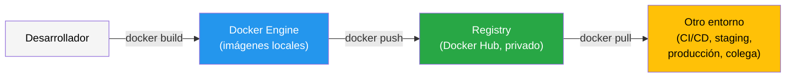
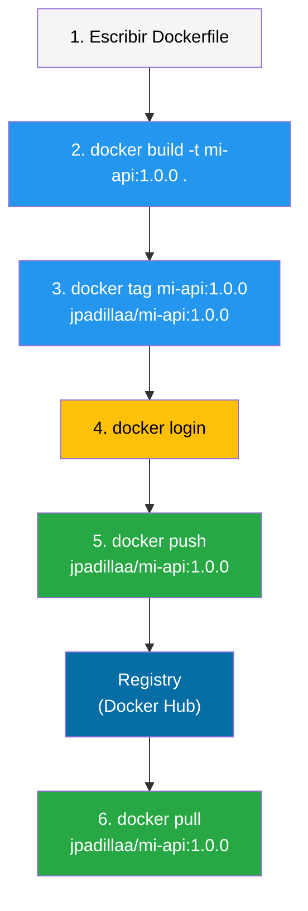

# Lectura 01 - Distribución y versionamiento de imágenes con Docker

## Prerrequisitos

Esta lectura asume que el estudiante:

- ha construido imágenes Docker a partir de un `Dockerfile`
- ha operado aplicaciones multicontenedor con Docker Compose
- comprende el ciclo de vida de contenedores e imágenes en un entorno local
- tiene familiaridad con `docker build`, `docker run` y `docker image ls`
- maneja la terminal en un entorno Linux o equivalente
- posee una cuenta en Docker Hub o está dispuesto a crearla durante el tutorial

## Introducción

Hasta este punto del curso, las imágenes Docker se han construido y utilizado dentro de la misma máquina. El flujo habitual ha consistido en escribir un `Dockerfile`, ejecutar `docker build`, verificar con `docker run` y referenciar la imagen en un archivo `compose.yml` local. Este modelo es suficiente mientras la imagen solo la necesite una persona en una sola máquina.

En la práctica, una imagen necesita **moverse** hacia otro desarrollador del equipo, hacia un servidor de pruebas, hacia un pipeline de integración continua o hacia un entorno de producción. Para que ese movimiento sea controlado, reproducible y trazable, se requiere un mecanismo formal de distribución.

Esta lectura presenta los conceptos y herramientas que permiten que una imagen Docker deje de ser un artefacto local y pase a ser un **artefacto compartible, versionable y recuperable**, mediante registries, repositorios, tags, digests y las prácticas de versionamiento que los articulan.

## Motivación

### La imagen local no es suficiente

Considere el siguiente escenario. Un desarrollador construye una imagen que contiene una API funcional. Un compañero necesita ejecutar esa misma imagen para probar la integración con otro servicio. Sin un mecanismo de distribución, las opciones son limitadas:

- compartir el `Dockerfile` y que el compañero reconstruya la imagen, lo cual no garantiza un resultado idéntico si el contexto de construcción o las dependencias cambiaron
- exportar la imagen como archivo tar con `docker save` y transferirla manualmente, un enfoque funcional pero no escalable
- copiar la imagen por medios informales

Ninguna de estas opciones es sostenible cuando el equipo crece, cuando existen ambientes automatizados o cuando se requiere trazabilidad sobre qué versión exacta de la imagen se desplegó en cada entorno.

### Distribución, reproducibilidad y trazabilidad

La distribución formal de imágenes atiende tres necesidades simultáneas:

- **Compartir**. Cualquier miembro del equipo o proceso automatizado puede obtener la misma imagen con un solo comando.
- **Reproducir**. La imagen obtenida es idéntica a la publicada, independientemente de quién la descargue o cuándo.
- **Trazar**. Cada imagen publicada puede vincularse a una versión del código, un commit o un momento específico del proceso de desarrollo.

> [!IMPORTANT]
> Tratar la imagen como un artefacto versionado y distribuible es un requisito práctico para cualquier flujo de trabajo que involucre más de un ambiente o más de un participante.

## Qué es un registry

### Definición

Un **registry** es un servicio de almacenamiento y distribución de imágenes de contenedores. Funciona como un repositorio centralizado donde las imágenes se publican (*push*) y desde donde se recuperan (*pull*). El registry más conocido y utilizado por defecto es **Docker Hub**, pero existen alternativas públicas y privadas.

### Relación con Docker Engine

Docker Engine opera con imágenes **locales**, es decir, las que se han construido o descargado en la máquina. Un registry es un servicio **externo** al Engine. La interacción se produce mediante dos operaciones principales:

- `docker push` envía una imagen local al registry
- `docker pull` descarga una imagen del registry al almacenamiento local



### Docker Hub

Docker Hub es el registry público por defecto de Docker. Al ejecutar `docker pull python:3.12`, Docker descarga la imagen desde Docker Hub sin necesidad de especificar la URL del registry. Docker Hub ofrece repositorios públicos, accesibles por cualquiera, y repositorios privados con acceso restringido.

### Registries privados y alternativos

Organizaciones con requisitos de control, seguridad o proximidad geográfica pueden operar registries propios o utilizar servicios gestionados de proveedores cloud.

| Registry | Tipo | Caso de uso típico |
|----------|------|-------------------|
| Docker Hub | Público / Privado | Imágenes oficiales, proyectos open source, repositorios personales |
| GitHub Container Registry (ghcr.io) | Público / Privado | Integración con repositorios de GitHub |
| Amazon ECR | Privado | Despliegues en AWS |
| Google Artifact Registry | Privado | Despliegues en GCP |
| Azure Container Registry | Privado | Despliegues en Azure |
| Registry self-hosted | Privado | Control total sobre infraestructura |

> [!NOTE]
> Esta lectura utiliza Docker Hub por su accesibilidad. Los conceptos de nomenclatura, tags y digests aplican de forma idéntica a cualquier registry compatible con la especificación OCI.

## Repositorios, nombres y namespaces

### Estructura del nombre de una imagen

Cuando se descarga una imagen con `docker pull nginx`, Docker interpreta ese nombre corto y lo expande a una referencia completa. La estructura general del nombre de una imagen es la siguiente.

```plaintext
[registry/][namespace/]repositorio[:tag|@digest]
```

| Componente | Descripción | Ejemplo |
|------------|-------------|---------|
| Registry | Dirección del registry | `docker.io`, `ghcr.io`, `123456789.dkr.ecr.us-east-1.amazonaws.com` |
| Namespace | Usuario, organización o proyecto | `jpadillaa`, `miorganizacion`, `library` |
| Repositorio | Nombre de la imagen | `mi-api`, `nginx`, `postgres` |
| Tag | Etiqueta de versión | `1.0.0`, `latest`, `dev` |
| Digest | Identificador inmutable basado en hash | `sha256:a1b2c3d4...` |

### Ejemplos de nombres completos

| Nombre usado | Nombre completo equivalente | Componentes |
|--------------|----------------------------|-------------|
| `nginx` | `docker.io/library/nginx:latest` | Registry: Docker Hub, Namespace: `library` (imágenes oficiales), Repo: `nginx`, Tag: `latest` |
| `python:3.12-slim` | `docker.io/library/python:3.12-slim` | Imagen oficial con tag específico |
| `jpadillaa/mi-api:1.0.0` | `docker.io/jpadillaa/mi-api:1.0.0` | Imagen de usuario con versión explícita |
| `ghcr.io/org/servicio:v2.1` | `ghcr.io/org/servicio:v2.1` | Registry de GitHub, namespace de organización |

> [!TIP]
> Cuando el registry es Docker Hub, se omite `docker.io/` por convención. Cuando el namespace es `library`, se omite también. Por eso `nginx` equivale a `docker.io/library/nginx:latest`. Para registries distintos de Docker Hub, la dirección del registry debe incluirse siempre.

### Namespace como espacio organizativo

El namespace agrupa repositorios bajo un usuario u organización. Si su usuario en Docker Hub es `jpadillaa`, todas sus imágenes se publican bajo el prefijo `jpadillaa/`:

- `jpadillaa/mi-api`
- `jpadillaa/mi-frontend`
- `jpadillaa/utilidades`

Cada uno de estos es un **repositorio** dentro del namespace `jpadillaa`. Dentro de cada repositorio pueden existir múltiples versiones identificadas por tags.

## Tags

### Qué representan

Un **tag** es una etiqueta de texto asociada a una versión específica de una imagen dentro de un repositorio. Es el mecanismo más común para referenciar versiones.

```bash
$ docker pull python:3.12-slim
$ docker pull python:3.11
$ docker pull python:latest
```

Cada uno de estos comandos descarga una versión diferente de la imagen `python`, identificada por su tag.

### El caso de `latest`

Cuando no se especifica un tag, Docker usa `latest` por defecto.

```bash
$ docker pull nginx
# equivale a
$ docker pull nginx:latest
```

Sin embargo, `latest` **no significa "la más reciente"** en un sentido automático. Es un tag como cualquier otro, con una particularidad: se asigna por defecto cuando se construye una imagen sin especificar tag, y se asume por defecto cuando se descarga una imagen sin especificar tag.

> [!WARNING]
> `latest` es un tag **mutable**. Puede apuntar a una versión diferente cada vez que el autor publica una nueva imagen sin tag explícito. Dos ejecuciones de `docker pull mi-imagen:latest` en momentos distintos pueden producir imágenes completamente diferentes. No utilice `latest` como referencia estable en ambientes de pruebas o producción.

### Estrategias de versionamiento con tags

Una práctica disciplinada de tagging permite que cualquier persona o proceso identifique con precisión qué versión de la imagen está utilizando.

| Estrategia | Ejemplo de tag | Uso |
|------------|----------------|-----|
| Semántica | `1.0.0`, `1.0.1`, `1.1.0` | Releases estables, versiones publicadas |
| Por ambiente | `dev`, `staging`, `prod` | Identificar la imagen destinada a cada entorno (mutable) |
| Por commit | `abc1234`, `sha-abc1234` | Trazabilidad directa con el código fuente |
| Por fecha o build | `20260331`, `build-142` | Correlación temporal |
| Combinada | `1.0.0-abc1234` | Versión semántica con referencia al commit |

> [!NOTE]
> Los tags por ambiente (`dev`, `staging`) son mutables por naturaleza y se sobreescriben con cada nueva imagen destinada a ese entorno. Los tags semánticos deben tratarse como **inmutables** una vez publicados: la versión `1.0.0` debe referir siempre a la misma imagen.

### Asignar múltiples tags a una imagen

Una misma imagen puede tener varios tags. Esto es frecuente cuando una imagen es simultáneamente la versión `1.2.3`, la versión `1.2` (último patch de la serie 1.2) y `latest`.

```bash
$ docker tag mi-api:latest jpadillaa/mi-api:1.2.3
$ docker tag mi-api:latest jpadillaa/mi-api:1.2
$ docker tag mi-api:latest jpadillaa/mi-api:latest
```

Los tres tags apuntan a la misma imagen, es decir, al mismo digest. Un usuario que descargue `jpadillaa/mi-api:1.2` obtendrá la versión más reciente del minor 1.2 sin necesidad de conocer el patch exacto.

## Digests

### Qué es un digest

Un **digest** es un identificador único e inmutable de una imagen, calculado como el hash SHA-256 de su manifiesto. A diferencia de un tag, un digest no puede sobreescribirse. Si el contenido de la imagen cambia, el digest cambia.

```plaintext
sha256:a3ed95caeb02ffe68cdd9fd84406680ae93d633cb16422d00e8a7c22955b46d4
```

### Tag vs. digest

| Característica | Tag | Digest |
|----------------|-----|--------|
| Legibilidad | Alta (`1.0.0`, `latest`) | Baja (`sha256:a3ed95c...`) |
| Mutabilidad | Mutable (puede apuntar a otra imagen) | Inmutable (siempre refiere al mismo contenido) |
| Garantía de reproducibilidad | No (el tag puede sobreescribirse) | Sí (el contenido está determinado por el hash) |
| Uso típico | Desarrollo, descargas, documentación | Producción crítica, auditoría, reproducibilidad estricta |

### Obtener el digest de una imagen

```bash
# Al hacer pull, Docker muestra el digest
$ docker pull jpadillaa/mi-api:1.0.0
1.0.0: Pulling from jpadillaa/mi-api
Digest: sha256:a3ed95caeb02ffe68cdd9fd84406680ae93d633cb16422d00e8a7c22955b46d4
Status: Downloaded newer image for jpadillaa/mi-api:1.0.0

# Inspeccionar el digest de una imagen local
$ docker image inspect jpadillaa/mi-api:1.0.0 --format '{{index .RepoDigests 0}}'
jpadillaa/mi-api@sha256:a3ed95caeb02ffe68cdd9fd84406680ae93d633cb16422d00e8a7c22955b46d4
```

### Referenciar una imagen por digest

```bash
$ docker pull jpadillaa/mi-api@sha256:a3ed95caeb02ffe68cdd9fd84406680ae93d633cb16422d00e8a7c22955b46d4
```

Este comando descarga exactamente esa versión de la imagen, independientemente de si el tag `1.0.0` fue sobreescrito con posterioridad.

> [!IMPORTANT]
> Cuando la reproducibilidad es crítica, como en despliegues de producción, auditorías o artefactos regulados, referenciar imágenes por digest elimina la ambigüedad que los tags mutables introducen.

## Flujo de distribución

### Visión general

El flujo completo desde la construcción hasta el consumo de una imagen sigue estos pasos.



### Autenticación

Antes de publicar una imagen es necesario autenticarse en el registry.

```bash
$ docker login
```

Docker solicita usuario y contraseña o token de acceso. Las credenciales se almacenan localmente en `~/.docker/config.json`.

Para registries distintos de Docker Hub, se especifica la dirección del servicio.

```bash
$ docker login ghcr.io
$ docker login 123456789.dkr.ecr.us-east-1.amazonaws.com
```

> [!CAUTION]
> El comando `docker login` almacena credenciales en el sistema de archivos local. En entornos compartidos o automatizados, utilice tokens de acceso con permisos limitados en lugar de contraseñas de cuenta. Docker Hub permite crear *Access Tokens* desde la configuración de la cuenta.

### Etiquetar para el registry

Una imagen construida localmente necesita un nombre que incluya el namespace del registry destino.

```bash
# Imagen local
$ docker build -t mi-api:1.0.0 .

# Retaggear para Docker Hub
$ docker tag mi-api:1.0.0 jpadillaa/mi-api:1.0.0
```

El comando `docker tag` no copia la imagen. Crea una referencia adicional que apunta a la misma imagen. Ambos nombres (`mi-api:1.0.0` y `jpadillaa/mi-api:1.0.0`) comparten las mismas capas.

### Publicar

```bash
$ docker push jpadillaa/mi-api:1.0.0
```

Docker sube al registry las capas de la imagen que no existen en él. Si las capas base ya fueron subidas previamente, por ejemplo `python:3.12-slim`, no se retransfieren.

### Recuperar

Desde otra máquina o entorno, la imagen se obtiene con un solo comando.

```bash
$ docker pull jpadillaa/mi-api:1.0.0
```

### Verificación

Después de descargar la imagen, verifique que corresponde a la esperada.

```bash
$ docker image ls jpadillaa/mi-api
REPOSITORY         TAG     IMAGE ID       CREATED        SIZE
jpadillaa/mi-api     1.0.0   a1b2c3d4e5f6   2 hours ago    125MB

$ docker image inspect jpadillaa/mi-api:1.0.0 --format '{{index .RepoDigests 0}}'
```

## Trazabilidad del artefacto

### Vincular imagen con código fuente

Una imagen publicada debe poder rastrearse hasta el código que la originó. Sin esta trazabilidad, resulta imposible determinar qué versión del código se ejecuta en producción o qué cambió entre la imagen v1.2.0 y v1.2.1.

Los mecanismos más simples para establecer esa relación son:

- **Tags que incluyen el hash del commit**, por ejemplo `jpadillaa/mi-api:1.0.0-abc1234`
- **Labels en el Dockerfile**, que permiten embeber metadatos directamente en la imagen

### Labels como metadatos

El `Dockerfile` admite la instrucción `LABEL` para registrar metadatos en la imagen.

```dockerfile
FROM python:3.12-slim

LABEL org.opencontainers.image.version="1.0.0"
LABEL org.opencontainers.image.source="https://github.com/jpadillaa/mi-api"
LABEL org.opencontainers.image.revision="abc1234"

WORKDIR /app
COPY requirements.txt .
RUN pip install --no-cache-dir -r requirements.txt
COPY . .

EXPOSE 5000
CMD ["python", "main.py"]
```

Estos labels pueden consultarse sin ejecutar el contenedor.

```bash
$ docker image inspect jpadillaa/mi-api:1.0.0 --format '{{json .Config.Labels}}' | python3 -m json.tool
{
    "org.opencontainers.image.version": "1.0.0",
    "org.opencontainers.image.source": "https://github.com/jpadillaa/mi-api",
    "org.opencontainers.image.revision": "abc1234"
}
```

> [!TIP]
> Las claves con prefijo `org.opencontainers.image.*` siguen la convención de la especificación OCI para metadatos de imágenes. Adoptar convenciones establecidas facilita la interoperabilidad con herramientas de auditoría y catálogo.

## Inspección y verificación

### Comandos de referencia

| Comando | Función |
|---------|---------|
| `docker image ls [repositorio]` | Lista imágenes locales, filtrando opcionalmente por repositorio |
| `docker image inspect <imagen>` | Muestra metadatos detallados de una imagen (labels, capas, digest) |
| `docker tag <origen> <destino>` | Crea un nuevo nombre o tag para una imagen existente |
| `docker push <imagen>` | Publica una imagen en el registry |
| `docker pull <imagen>` | Descarga una imagen desde el registry |
| `docker login [registry]` | Autentica al usuario contra un registry |
| `docker manifest inspect <imagen>` | Muestra el manifiesto remoto de una imagen sin descargarla |

### Verificar labels

```bash
$ docker image inspect jpadillaa/mi-api:1.0.0 \
  --format '{{index .Config.Labels "org.opencontainers.image.revision"}}'
abc1234
```

### Verificar el digest local vs. remoto

```bash
# Digest local
$ docker image inspect jpadillaa/mi-api:1.0.0 --format '{{index .RepoDigests 0}}'

# Digest remoto (sin descargar la imagen)
$ docker manifest inspect jpadillaa/mi-api:1.0.0
```

## Errores comunes y troubleshooting

### Confusión entre nombre local y nombre remoto

**Síntoma.** `docker push mi-api:1.0.0` falla con un mensaje que indica que el repositorio no existe o que se requiere autenticación.

**Causa.** El nombre `mi-api:1.0.0` corresponde a una referencia local y no incluye un namespace válido del registry. En Docker Hub, esto puede llevar a que Docker intente resolver la publicación en `docker.io/library/mi-api`, que no corresponde al espacio de trabajo de un usuario individual.

**Solución.** Etiquete la imagen con el nombre remoto completo antes de publicarla.

```bash
$ docker tag mi-api:1.0.0 jpadillaa/mi-api:1.0.0
$ docker push jpadillaa/mi-api:1.0.0
```

### Error por no autenticarse

**Síntoma.** Aparece un mensaje como `denied: requested access to the resource is denied`.

**Causa.** No se ejecutó `docker login` antes de `docker push`, la sesión expiró o las credenciales activas no corresponden a un usuario con permisos sobre el repositorio de destino.

**Solución.** Ejecute `docker login`, confirme que la autenticación fue exitosa e intente nuevamente la publicación.

### Repositorio inexistente o sin permisos

**Síntoma.** Se presenta un error como `repository does not exist or may require 'docker login'`.

**Causa.** El repositorio no existe en el registry, el nombre remoto fue escrito incorrectamente o el usuario autenticado no tiene permisos de escritura sobre ese namespace.

**Solución.** Verifique el nombre completo del repositorio, confirme la cuenta con la que inició sesión y revise el comportamiento del registry utilizado. En Docker Hub, un repositorio bajo un namespace válido suele quedar disponible con el primer `push`. En registries privados, puede ser necesario crearlo previamente o solicitar permisos explícitos.

### Sobrescritura accidental de tags

**Síntoma.** Un integrante del equipo reporta que la imagen `1.0.0` se comporta de forma distinta a la que descargó la semana anterior.

**Causa.** Se publicó una nueva imagen utilizando el mismo tag `1.0.0`, de modo que la referencia visible se mantuvo, pero el contenido asociado cambió.

**Solución.** Establezca como política del equipo que los tags semánticos, por ejemplo `1.0.0` o `2.1.3`, no se reutilizan después de ser publicados. Si se requiere una corrección, publique una nueva versión, por ejemplo `1.0.1`. Cuando la verificación de integridad sea importante, compare los digests de las imágenes involucradas.

### Asumir que `latest` es la versión correcta

**Síntoma.** Un despliegue usa `latest` y la aplicación se comporta de forma inesperada.

**Causa.** El tag `latest` fue sobreescrito por una versión diferente entre el momento de la prueba y el momento del despliegue.

**Solución.** Use tags de versión explícitos en cualquier ambiente que no sea exploración local.

### Confusión entre tag y digest

**Síntoma.** Un desarrollador asume que dos imágenes son idénticas porque tienen el mismo tag en diferentes máquinas, pero se comportan diferente.

**Causa.** El tag fue sobreescrito en el registry entre ambas descargas. Las dos máquinas tienen imágenes distintas bajo el mismo tag.

**Solución.** Compare los digests de ambas imágenes con `docker image inspect`. Si difieren, las imágenes son diferentes a pesar del tag compartido.

### No saber qué versión se desplegó

**Síntoma.** Un incidente en producción requiere identificar qué versión exacta de la imagen se está ejecutando, pero solo se registró el tag `latest`.

**Causa.** No se documentó el digest ni se usaron tags trazables.

**Solución.** Registre el digest de cada despliegue. Para consultar el digest del contenedor en ejecución, utilice el siguiente comando.

```bash
$ docker inspect <contenedor> --format '{{.Image}}'
```

## Buenas prácticas

- **Use convenciones claras de nombres y tags.** Defina una convención de nomenclatura para el equipo y aplíquela de forma consistente. Un tag como `1.2.3` comunica más que `nueva-version` o `fix-viernes`.
- **Evite depender de `latest`.** Utilice `latest` para exploración local o como complemento, nunca como referencia principal en ambientes controlados.
- **Trate los tags semánticos como inmutables.** Una vez publicada la versión `1.0.0`, no la sobreescriba. Si hay correcciones, publique `1.0.1`.
- **Mantenga coherencia entre versión de aplicación e imagen.** Si la aplicación es v2.3.1, la imagen debería etiquetarse como `2.3.1`. Evite que la versión de la imagen y la versión del código lleven numeraciones independientes.
- **Considere el digest para reproducibilidad estricta.** En pipelines de producción, registre o utilice el digest como referencia definitiva.
- **Documente el origen de las imágenes.** Use labels OCI para embeber información sobre el commit, la rama o el repositorio de código fuente que originó la imagen.
- **No publique imágenes sin revisión.** Trate el `push` como un acto de publicación formal, no como un respaldo informal.
- **Use tokens de acceso en lugar de contraseñas.** Para `docker login` en entornos automatizados o compartidos, cree tokens con permisos limitados.

## Preguntas de autoevaluación

1. Un equipo publica todas sus imágenes con el tag `latest`. ¿Qué riesgos introduce esta práctica y cómo se mitigan?

2. ¿Qué garantía ofrece un digest que un tag no puede ofrecer? ¿En qué escenarios es preferible referenciar una imagen por digest?

3. ¿Qué información se puede embeber en una imagen mediante labels, y por qué esto contribuye a la trazabilidad del artefacto?

## Referencias

- Docker Inc. *Docker Hub quickstart*. https://docs.docker.com/docker-hub/
- Docker Inc. *docker push*. https://docs.docker.com/reference/cli/docker/image/push/
- Docker Inc. *docker pull*. https://docs.docker.com/reference/cli/docker/image/pull/
- Docker Inc. *docker tag*. https://docs.docker.com/reference/cli/docker/image/tag/
- Docker Inc. *Manage access tokens*. https://docs.docker.com/security/for-developers/access-tokens/
- Open Container Initiative. *OCI Image Spec: Annotations*. https://specs.opencontainers.org/image-spec/annotations/
- Nickoloff, J., & Kuenzli, S. *Docker in Action* (2nd ed.). Manning Publications. (Capítulo 3: Software installation simplified).
- Stoneman, E. *Learn Docker in a Month of Lunches*. Manning Publications.
